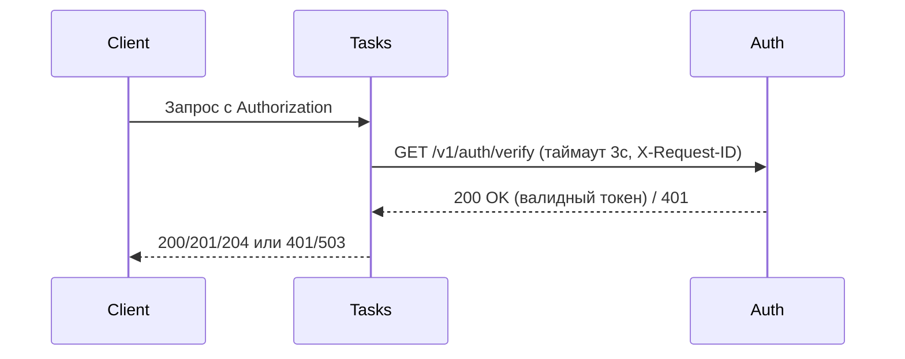
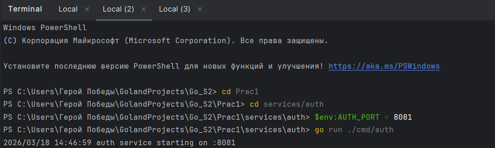
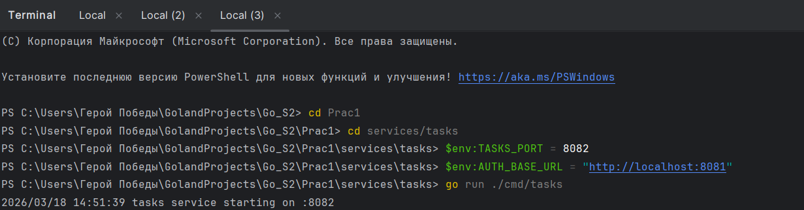
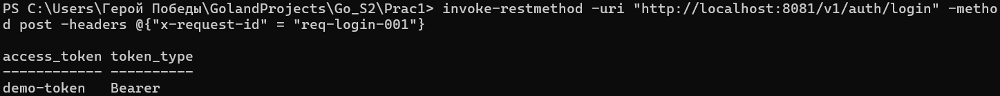
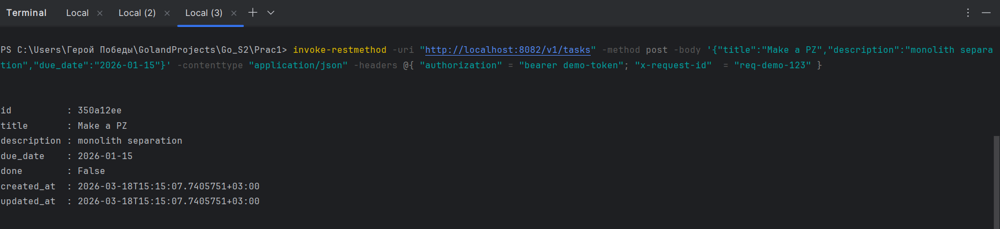
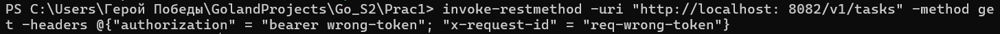
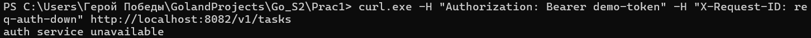
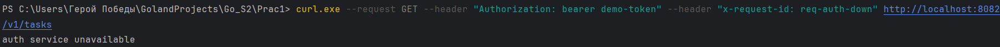
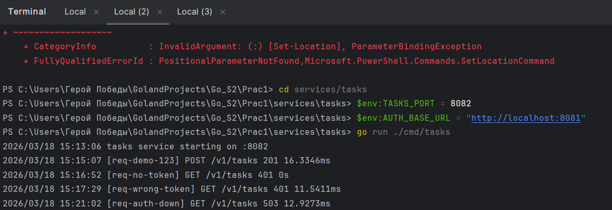
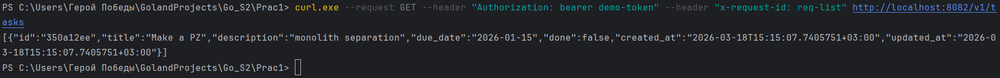

# Практическое занятие №1


ФИО: Пряшников Дмитрий Максимович
Группа: ПИМО-01-25

## Описание решения

Проект состоит из двух микросервисов:
- **Auth service** – отвечает за выдачу и проверку токенов (учебная реализация).
- **Tasks service** – CRUD для задач, перед каждой операцией проверяет токен через Auth.

Взаимодействие синхронное по HTTP. Во все запросы прокидывается `X-Request-ID` для сквозной трассировки, установлены таймауты (3 секунды) на вызов Auth.

## Границы ответственности

- **Auth**: только аутентификация/авторизация (в данном упрощении – проверка фиксированного токена).
- **Tasks**: управление задачами, хранение в памяти, проверка доступа делегируется Auth.

## Схема взаимодействия


# Запуск
## Предварительные требования
### Go 1.18+

Установите зависимости в корне проекта:
```markdown
go mod tidy
```
## Запуск Auth service
```bash
cd services/auth
export AUTH_PORT=8081
go run ./cmd/auth
```
## Запуск Tasks service
```bash
cd services/tasks
export TASKS_PORT=8082
export AUTH_BASE_URL=http://localhost:8081
go run ./cmd/tasks
```

## Переменные окружения
```markdown
Сервис	Переменная	Значение по умолчанию	Описание
Auth	AUTH_PORT	8081	Порт, на котором слушает Auth
Tasks	TASKS_PORT	8082	Порт Tasks
Tasks	AUTH_BASE_URL	http://localhost:8081	Базовый URL для вызова Auth
```
## Примеры запросов
### Получить токен
```bash
curl -s -X POST http://localhost:8081/v1/auth/login \
  -H "Content-Type: application/json" \
  -H "X-Request-ID: req-001" \
  -d '{"username":"student","password":"student"}'
```
### Создать задачу (с токеном)
```bash
curl -i -X POST http://localhost:8082/v1/tasks \
  -H "Content-Type: application/json" \
  -H "Authorization: Bearer demo-token" \
  -H "X-Request-ID: req-002" \
  -d '{"title":"Выполнить ПЗ","description":"разделение монолита","due_date":"2026-01-15"}'
```
### Попытка без токена (ожидается 401)
```bash
curl -i http://localhost:8082/v1/tasks -H "X-Request-ID: req-003"
```

## Проверка работы 
### Запуск сервисов



### Производим запросы в терминале





**Отработка сервисов на запросы**


**Производим выключение сервиса**


### Отработка кода с выключенным сервисом



### Включаем сервис и производим последнюю проверку 



## Ответы на вопросы 


### 1. Почему межсервисный вызов должен иметь таймаут?

Таймаут необходим для защиты от **зависаний** и **исчерпания ресурсов**. Если сервис-получатель (например, Auth) завис или стал недоступен, вызывающий сервис (Tasks) не должен ждать ответа бесконечно. Таймаут ограничивает время ожидания, позволяя:
- Освободить горутины и соединения, которые иначе заблокировались бы навсегда.
- Быстро вернуть клиенту ошибку (например, 503/504) вместо бесконечного ожидания.
- Предотвратить каскадное падение при отказе одного из сервисов.

### 2. Чем request-id помогает при диагностике ошибок?

**X-Request-ID** (или correlation ID) — это уникальный идентификатор, который присваивается запросу клиента и прокидывается через все сервисы, участвующие в обработке. Благодаря этому:
- В логах всех сервисов можно найти записи, относящиеся к одному и тому же запросу, и восстановить полную картину его прохождения.
- Упрощается трассировка: по request-id легко понять, на каком этапе произошла ошибка.
- Позволяет связать запрос клиента с внутренними вызовами между сервисами, что критично при отладке распределённых систем.

### 3. Какие статусы нужно вернуть клиенту при невалидном токене?

При невалидном или отсутствующем токене сервис Tasks должен вернуть клиенту **401 Unauthorized**. Важно не различать причины (токен истёк, неверный формат, отсутствует) — ответ должен быть единообразным, чтобы не давать злоумышленнику информацию для подбора. Если Auth сервис вернул 401, Tasks просто транслирует его клиенту. В случае, если Auth недоступен или вернул 5xx, Tasks может вернуть **503 Service Unavailable** или **502 Bad Gateway**, но не 401.

### 4. Чем опасно "делить одну БД" между сервисами?

Разделение одной базы данных между несколькими сервисами нарушает принцип **слабой связанности** микросервисной архитектуры и ведёт к следующим проблемам:
- **Скрытые зависимости** — изменение схемы данных для одного сервиса может сломать другой.
- **Конкуренция за ресурсы** — один сервис может заблокировать таблицы, замедляя работу другого.
- **Сложность масштабирования** — невозможно независимо масштабировать сервисы, так как база остаётся единым узким местом.
- **Нарушение инкапсуляции** — внутренняя структура данных одного сервиса становится доступной для другого, что ведёт к неявным контрактам и усложняет эволюцию системы.

Правильный подход — каждый сервис владеет своей БД и взаимодействует с другими только через API.
