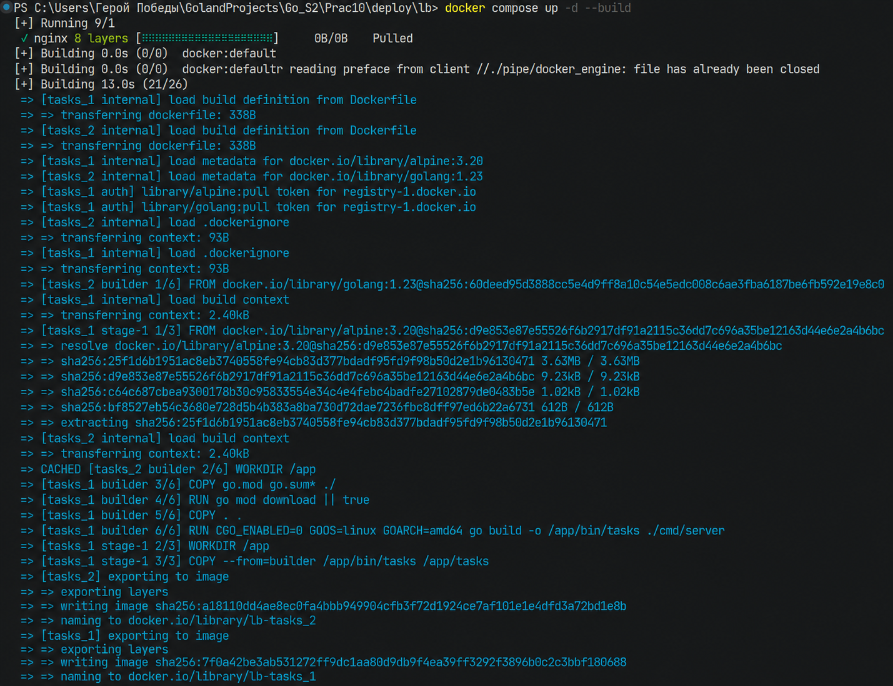
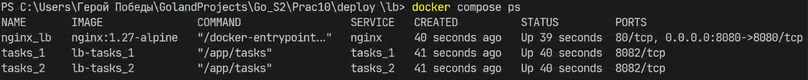
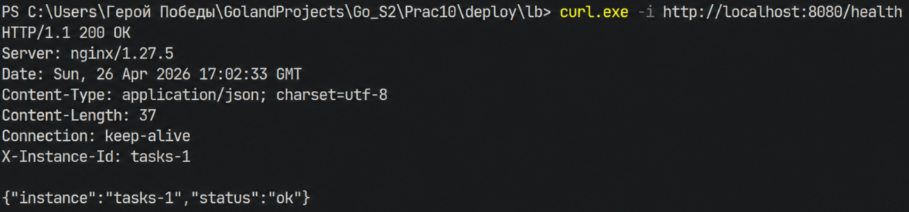
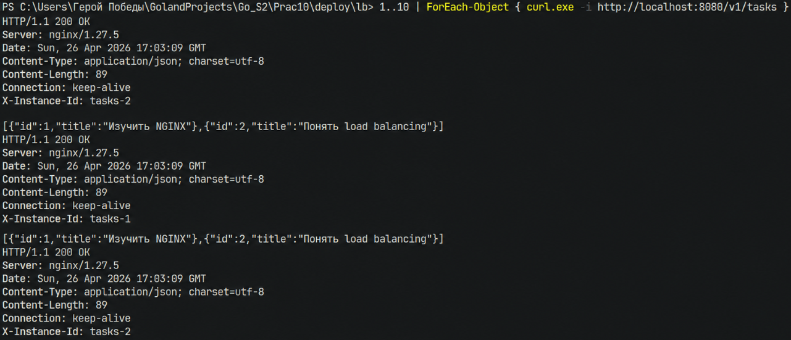
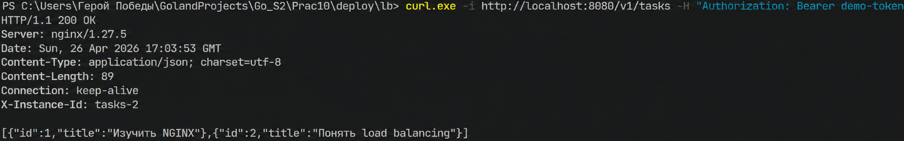
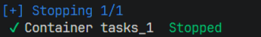
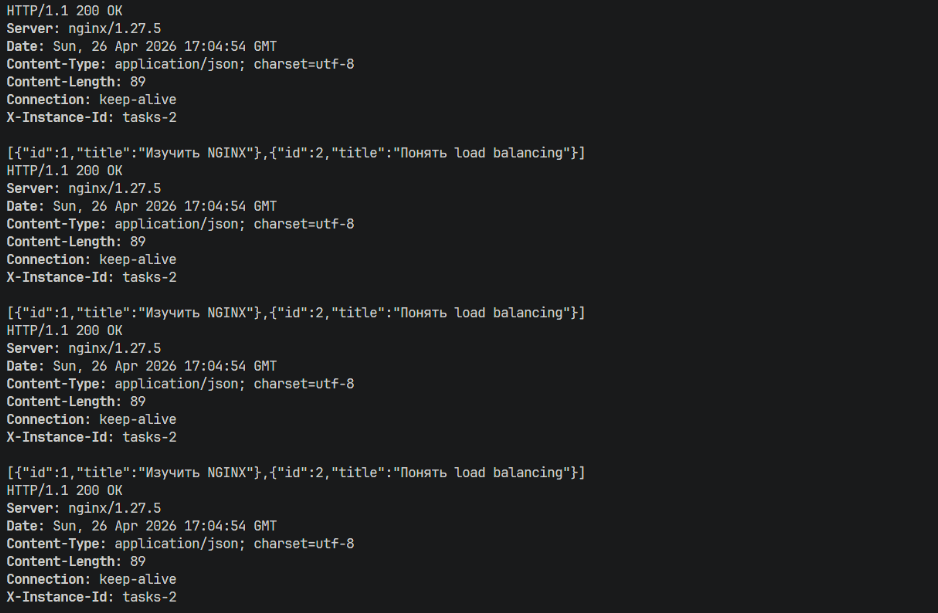
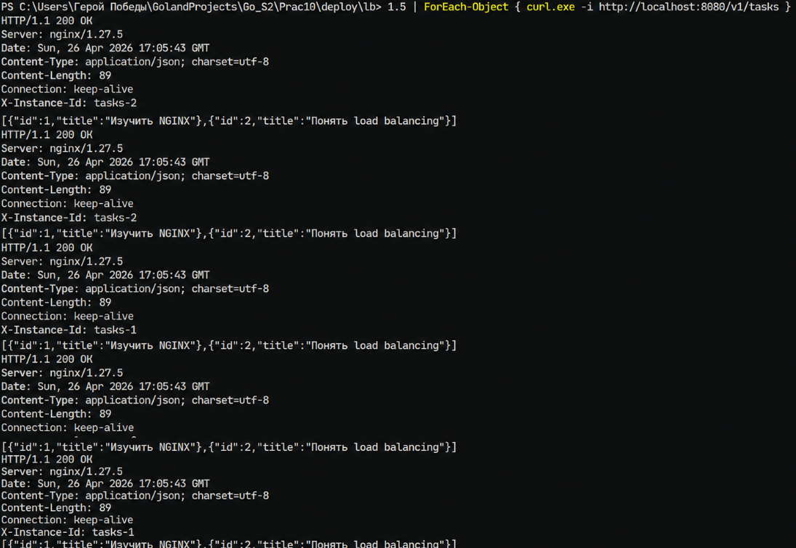

# Практическое занятие №10: Горизонтальное масштабирование с NGINX


**ФИО: Пряшников Д.М.**  
**Группа: ПИМО-01-25**

Реализация горизонтального масштабирования backend-приложения: запуск нескольких реплик сервиса `tasks` и распределение трафика через NGINX в роли балансировщика нагрузки.

---

## Цель работы

Освоить базовый подход к горизонтальному масштабированию backend-приложения за счёт запуска нескольких экземпляров одного сервиса и распределения входящих HTTP-запросов через NGINX в роли балансировщика нагрузки.

---

## Выполненные задачи

- Создан сервис `tasks` на Go с эндпоинтами `/health`, `/v1/tasks`, `/whoami`.
- Сервис читает `INSTANCE_ID` из переменной окружения и добавляет заголовок `X-Instance-ID` в каждый ответ.
- Написан `Dockerfile` для сборки контейнера (multi-stage build).
- Настроен NGINX с `upstream tasks_backend` для двух реплик.
- Создан `docker-compose.yml`, запускающий:
  - `tasks_1` и `tasks_2` (две реплики сервиса),
  - `nginx` (балансировщик, слушает порт 8080).
- Проверена балансировка запросов (round-robin) через заголовок `X-Instance-ID`.
- Продемонстрирована отказоустойчивость: остановка одной реплики не прерывает работу системы.
- **Дополнительное задание (вариант 1 и 3)** – добавлена третья реплика `tasks_3` и эндпоинт `/whoami`.

---

## Структура проекта

```text
Prac10/
├── services/
│   └── tasks/
│       ├── cmd/
│       │   └── server/
│       │       └── main.go           # сервис tasks
│       ├── .dockerignore
│       ├── Dockerfile
│       └── go.mod
├── deploy/
│   └── lb/
│       ├── docker-compose.yml        # 3 реплики + nginx
│       └── nginx.conf                # upstream и reverse proxy
└── README.md
```

---

## Запуск

Перейдите в папку `deploy/lb` и выполните:

```bash
docker compose up -d --build
```



Проверка статуса:

```bash
docker compose ps
```



Внешняя точка входа: **http://localhost:8080**

---

## Проверка работы

### Health endpoint

```bash
curl -i http://localhost:8080/health
```



Ожидается:
- HTTP 200
- `X-Instance-ID: tasks-1` или `tasks-2`
- `{"status":"ok","instance":"tasks-1"}`

### Балансировка запросов

Выполните несколько запросов к `/v1/tasks`:

```bash
for i in {1..10}; do curl -i http://localhost:8080/v1/tasks 2>/dev/null | grep "X-Instance-ID"; done
```



Заголовок `X-Instance-ID` должен чередоваться между `tasks-1` и `tasks-2` (по умолчанию round-robin).

### Проксирование заголовков через NGINX

```bash
curl -i http://localhost:8080/v1/tasks -H "Authorization: Bearer demo-token"
```



NGINX передаёт заголовок `Authorization` в backend (сервис `tasks` его не валидирует, но факт проксирования демонстрируется).

### Отказоустойчивость

Остановите одну реплику:

```bash
docker compose stop tasks_1
```



Снова выполните серию запросов:

```bash
for i in {1..5}; do curl -i http://localhost:8080/v1/tasks 2>/dev/null | grep "X-Instance-ID"; done
```




Теперь все ответы приходят только от `tasks-2`. Система продолжает работать.

Верните реплику:

```bash
docker compose start tasks_1
```

Балансировка восстанавливается.

---

## Дополнительные задания

### Вариант 1 – Третья реплика

В `docker-compose.yml` добавлен сервис `tasks_3`:

```yaml
tasks_3:
  build:
    context: ../../services/tasks
  container_name: tasks_3
  environment:
    APP_PORT: "8082"
    INSTANCE_ID: "tasks-3"
```

В `nginx.conf` обновлён upstream:

```nginx
upstream tasks_backend {
    server tasks_1:8082;
    server tasks_2:8082;
    server tasks_3:8082;
}
```

После перезапуска заголовок `X-Instance-ID` чередуется уже между тремя значениями.

### Вариант 3 – Эндпоинт `/whoami`

В `main.go` добавлен маршрут:

```go
mux.HandleFunc("/whoami", func(w http.ResponseWriter, r *http.Request) {
    w.Header().Set("Content-Type", "application/json")
    w.Header().Set("X-Instance-ID", instanceID)
    json.NewEncoder(w).Encode(map[string]string{"instance": instanceID})
})
```

Проверка:

```bash
curl http://localhost:8080/whoami
```

Возвращает `{"instance":"tasks-1"}` и заголовок `X-Instance-ID`.

---

## Контрольные вопросы

### 1. Что такое горизонтальное масштабирование?

Горизонтальное масштабирование – это увеличение количества экземпляров приложения (реплик), которые работают параллельно. Запросы распределяются между ними через балансировщик нагрузки.

---

### 2. Чем оно отличается от вертикального масштабирования?

| Тип | Суть | Пример | Преимущества | Недостатки |
|-----|------|--------|--------------|-------------|
| **Вертикальное** | Увеличение ресурсов одного сервера (CPU, RAM) | Переход с 2 vCPU на 8 vCPU | Проще, не меняет архитектуру | Есть физический предел, дорого |
| **Горизонтальное** | Добавление новых серверов/контейнеров | 2 реплики → 10 реплик | Практически безгранично, отказоустойчивость | Требует балансировки, stateless-дизайна |

---

### 3. Зачем нужен load balancer?

Load balancer (балансировщик нагрузки) решает задачи:
- **Единая точка входа** – клиент работает с одним адресом, не зная о репликах.
- **Распределение трафика** – запросы направляются на разные реплики.
- **Отказоустойчивость** – если реплика выходит из строя, трафик перенаправляется на живые.
- **Масштабирование** – можно добавлять/удалять реплики без изменения клиентского кода.

---

### 4. Какую роль в этой работе выполняет NGINX?

NGINX выступает в роли **reverse proxy** и **балансировщика нагрузки**:
- Принимает входящие HTTP-запросы на порту 8080.
- Согласно конфигурации `upstream`, перенаправляет их на одну из реплик (`tasks_1`, `tasks_2`, `tasks_3`).
- Использует алгоритм round-robin (по умолчанию).
- Проксирует заголовки (Authorization, X-Request-ID) в backend.

---

### 5. Что такое upstream в NGINX?

`upstream` – это блок в конфигурации NGINX, который определяет группу backend-серверов (реплик). Пример:

```nginx
upstream tasks_backend {
    server tasks_1:8082;
    server tasks_2:8082;
    server tasks_3:8082;
}
```

Затем в `location /` указывается `proxy_pass http://tasks_backend;`. NGINX распределяет запросы между серверами из этой группы.

---

### 6. Почему для горизонтального масштабирования желательно делать сервис stateless?

**Stateless** – сервис не хранит состояние пользователя в своей локальной памяти между запросами. Если сервис хранит данные только в памяти, то:
- Запрос к `tasks-1` может записать данные.
- Следующий запрос от того же пользователя может попасть на `tasks-2`, который этих данных не знает.
- Поведение становится непредсказуемым.

**Решение:** выносить состояние в общее хранилище (PostgreSQL, Redis). Тогда любая реплика имеет доступ к одним и тем же данным.

---

### 7. Зачем нужен health endpoint?

`GET /health` используется для проверки, жив ли экземпляр сервиса. В данном стенде он нужен для ручной диагностики. В реальных системах балансировщики (или оркестраторы вроде Kubernetes) периодически опрашивают `/health` и исключают реплики, которые перестали отвечать.

---

### 8. Почему полезно добавлять X-Instance-ID?

Заголовок `X-Instance-ID` позволяет **наглядно увидеть**, какая реплика обработала запрос. Без него балансировка выглядит как «чёрный ящик». С этим заголовком разработчик может:
- убедиться, что трафик действительно распределяется;
- отследить, какая реплика вызывает ошибку;
- проверить отказоустойчивость.

---

### 9. Что происходит при остановке одной из реплик?

В текущей конфигурации NGINX продолжает отправлять запросы на остановленную реплику, пока не получит от неё ошибку соединения. Это может вызвать задержки или ошибки для некоторых запросов. Однако после нескольких неудачных попыток NGINX (при использовании директив `max_fails` и `fail_timeout`) может временно исключить реплику. В учебном примере без дополнительных настроек поведение не идеально, но студент видит, что система **не падает полностью** – запросы продолжают обслуживаться живыми репликами.

---

### 10. Почему клиенту удобнее работать с одной точкой входа, а не с несколькими адресами реплик?

- **Простота** – клиент запоминает один адрес (например, `https://api.example.com`).
- **Независимость от внутренней архитектуры** – можно добавить или убрать реплики, клиент ничего не узнает.
- **Балансировка** – клиенту не нужно самому решать, к какой реплике идти.
- **Отказоустойчивость** – если одна реплика упала, клиент всё равно обращается к тому же адресу и (при правильной настройке балансировщика) получит ответ от другой.

---

## Типичные ошибки

| Ошибка | Причина | Решение |
|--------|---------|---------|
| Контейнеры tasks проброшены наружу (ports:) | Клиент обращается напрямую к репликам, минуя NGINX | Убрать `ports` у tasks, оставить только у nginx |
| В nginx.conf указан `localhost:8082` вместо `tasks_1:8082` | Имена контейнеров внутри Docker-сети не совпадают | Использовать имена сервисов из docker-compose.yml |
| Отсутствует `X-Instance-ID` | Сервис не читает `INSTANCE_ID` или не добавляет заголовок | Добавить чтение переменной и установку заголовка |
| После остановки реплики запросы иногда падают с ошибкой | NGINX не настроен на проверку health | Для учебной демонстрации достаточно, но в реальности нужны `max_fails`, `fail_timeout` или активные проверки |
| Сервис хранит состояние в памяти, и данные "прыгают" между репликами | Сервис не stateless | Использовать общую БД или Redis (выходит за рамки ПЗ, но важно понимать) |
