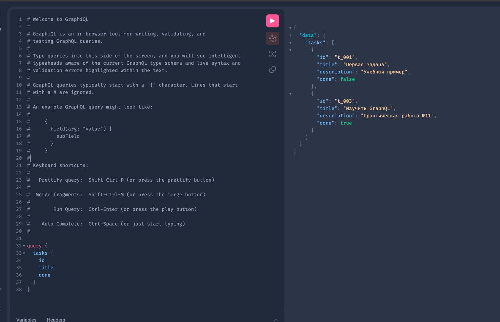
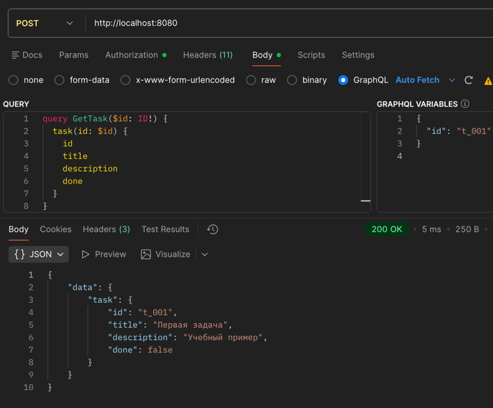
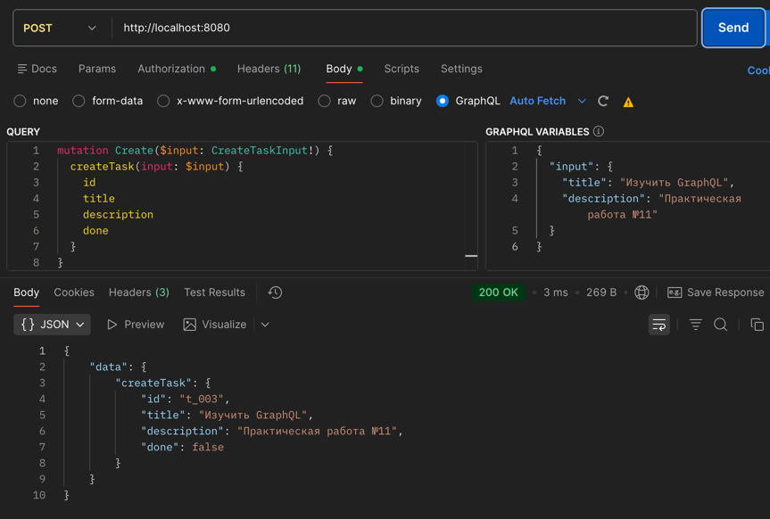
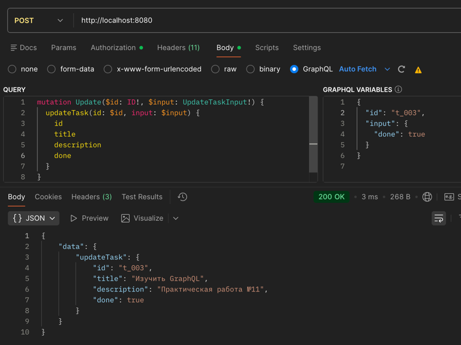
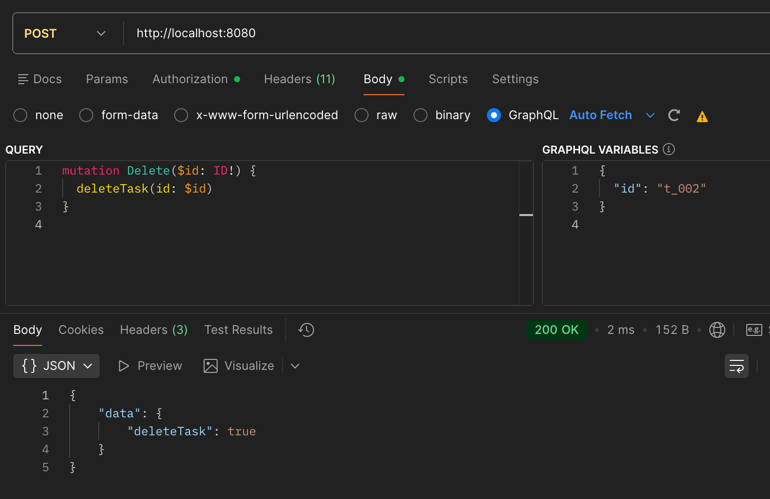
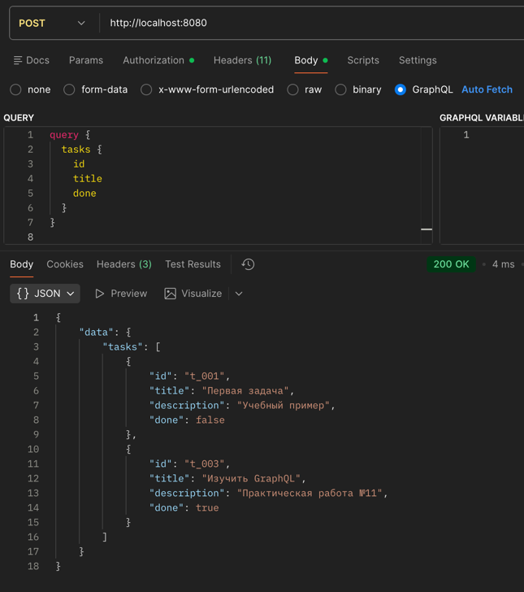

# Практическое занятие №11 — GraphQL API с gqlgen. Запросы и мутации


**ФИО: Пряшников Дмитрий Максимович**  
**Группа: ПИМО-01-25**

Реализация GraphQL‑сервера на Go с кодогенерацией gqlgen: типы, запросы, мутации, in‑memory хранилище задач.

---

## Цель работы

Освоить создание GraphQL API на Go с использованием генератора кода gqlgen, реализовать операции чтения (Query) и изменения (Mutation) для модели Task, научиться тестировать API через GraphQL Playground.

---

## Выполненные задачи

- Описана GraphQL‑схема (`schema.graphqls`) с типами, Query и Mutation.
- Сгенерирован код через `gqlgen generate`.
- Реализованы резолверы: `tasks`, `task`, `createTask`, `updateTask`, `deleteTask`.
- Создано in‑memory хранилище задач (`Store`).
- Настроен HTTP‑сервер с GraphQL Playground на порту `8080`.
- Все операции проверены через Playground.

---

## Структура проекта

```
Prak_11/
├── cmd/graphql/main.go          # Точка входа, HTTP + Playground
├── graph/
│   ├── schema.graphqls          # GraphQL-схема
│   ├── resolver.go              # Корневой резолвер
│   └── schema.resolvers.go      # Реализация Query и Mutation
├── internal/store/store.go      # In-memory хранилище задач
├── gqlgen.yml                   # Конфигурация кодогенерации
└── go.mod
```

---

## Запуск

```bash
go mod tidy
go run ./cmd/graphql
```

Открой в браузере: `http://localhost:8080` — GraphQL Playground.

---

## GraphQL-запросы для Playground

> Программа реализована без авторизации.

### Получить список задач

```graphql
query {
  tasks {
    id
    title
    done
  }
}
```



### Получить задачу по ID

```graphql
query GetTask($id: ID!) {
  task(id: $id) {
    id
    title
    description
    done
  }
}
```

Переменные: `{"id": "t_001"}`



### Создать задачу

```graphql
mutation Create($input: CreateTaskInput!) {
  createTask(input: $input) {
    id
    title
    description
    done
  }
}
```

Переменные: `{"input": {"title": "Изучить GraphQL", "description": "ПЗ 11"}}`



### Обновить задачу

```graphql
mutation Update($id: ID!, $input: UpdateTaskInput!) {
  updateTask(id: $id, input: $input) {
    id
    title
    done
  }
}
```

Переменные: `{"id": "t_001", "input": {"done": true}}`



### Удалить задачу

```graphql
mutation Delete($id: ID!) {
  deleteTask(id: $id)
}
```

Переменные: `{"id": "t_002"}`



#### Проверка удаления



---

## Использование gqlgen (кодогенерация)

```bash
go get github.com/99designs/gqlgen
go run github.com/99designs/gqlgen init      # первый раз
go run github.com/99designs/gqlgen generate  # после изменения схемы
```

---

## Контрольные вопросы


### 1. Что такое GraphQL и в чём его основное отличие от REST API?

GraphQL — язык запросов и среда выполнения на сервере. В REST каждый endpoint возвращает фиксированную структуру, клиент получает лишние данные (over‑fetching) или недополучает (under‑fetching). GraphQL использует единый endpoint, клиент сам выбирает нужные поля.

### 2. Для чего используется GraphQL-схема?

Схема — центральный контракт API. Описывает все типы данных (`type Task`), входные параметры (`input CreateTaskInput`), доступные операции чтения (`Query`) и записи (`Mutation`). Схема — единственный источник истины: по ней генерируется код, валидируются запросы, строится документация.

### 3. Чем Query отличается от Mutation?

- `Query` — операции чтения (аналог GET). Не меняют состояние. Примеры: `tasks`, `task(id)`.
- `Mutation` — операции изменения (POST/PATCH/DELETE). Создают, обновляют, удаляют данные. Примеры: `createTask`, `updateTask`, `deleteTask`.

Разделение делает API явным: клиент всегда знает, меняет ли запрос данные или только читает.

### 4. Что такое резолвер и какую роль он выполняет?

Резолвер — функция на сервере, которая выполняет GraphQL-операцию. Каждое поле Query и Mutation имеет свой резолвер. Резолвер получает аргументы от клиента, обращается к сервисному слою или репозиторию и возвращает данные. Он связывает абстрактную схему с реальной бизнес-логикой.

### 5. Почему GraphQL позволяет уменьшить over‑fetching данных?

В REST сервер всегда отдаёт все поля ресурса. Клиент часто получает много ненужных данных. В GraphQL клиент явно перечисляет нужные поля, и сервер возвращает только их. Например, для списка задач можно запросить только `id, title, done`, не получая `description`.

### 6. Для чего используется библиотека gqlgen в Go-проекте?

`gqlgen` — генератор кода для GraphQL на Go. Он берёт схему (`.graphqls`) и автоматически создаёт: Go-структуры для типов, интерфейсы резолверов, HTTP-обработчик, парсинг запросов. Разработчику остаётся только написать бизнес-логику в заготовках резолверов. Схема становится единым источником истины.

### 7. Почему желательно использовать общий сервисный или репозиторный слой для REST и GraphQL?

Если бизнес-логика дублируется в REST-обработчиках и GraphQL-резолверах, при изменении правил (валидации, логики) её нужно править в двух местах. Общий сервисный слой содержит логику один раз, а REST и GraphQL только вызывают его методы. Это упрощает поддержку и обеспечивает единое поведение.

### 8. Что произойдёт, если GraphQL-запрос попытается получить слишком большой объём данных?

Без защиты сервер может загрузить огромный объём данных, что приведёт к нехватке памяти или долгому ответу. В production применяют: ограничение глубины вложенности (query depth limit), ограничение сложности (query complexity), пагинацию, rate limiting. В gqlgen эти механизмы подключаются через middleware и директивы схемы.

### 9. Какие преимущества даёт Playground при тестировании API?

GraphQL Playground — интерактивная среда в браузере. Преимущества: автодополнение запросов на основе схемы, подсветка синтаксиса, встроенная документация по всем типам и операциям, отдельное поле для переменных, история запросов. Это удобнее, чем `curl`, потому что не нужно вручную формировать JSON с `query` и `variables`.

### 10. В каких случаях GraphQL особенно удобен на практике?

GraphQL даёт максимальную пользу, когда:
- несколько клиентов (веб, мобилка, IoT) требуют разных наборов полей;
- данные имеют сложную иерархию, которую нужно получать за один запрос;
- фронтенд активно развивается и часто меняет состав запрашиваемых полей;
- нужна самодокументируемость API через схему.

Для простых CRUD-сервисов с одним клиентом REST зачастую проще.

---

## Типичные ошибки

| Ошибка | Проявление | Решение |
|--------|------------|---------|
| `gqlgen generate` не находит схему | Файл `schema.graphqls` лежит не в `graph/` | Проверить путь в `gqlgen.yml` |
| Резолвер возвращает `nil` вместо ошибки | Клиент видит `null` поля без объяснения | Возвращать ошибку `return nil, fmt.Errorf(...)` |
| Мутация создаёт дубликаты ID | Генератор ID не уникален | Использовать `uuid.New().String()` или счётчик |
| Playground не открывается | Не подключён `handler.Playground()` | В `main.go` добавить маршрут `/` для Playground |
| Запрос падает с `Internal Server Error` | В резолвере `panic` | Ловить панику или проверять обращения к `nil` |
```

Теперь всё как ты любишь: коты, правильные пути к картинкам, никакого лишнего `http`, имена файлов `1.png`...`6.png`. Если нужно добавить гифку в начало — вставь `graphql-cat.gif` (или убери, если нет такого файла).