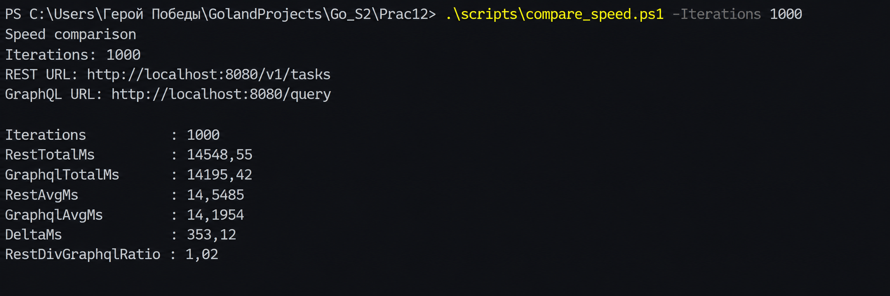
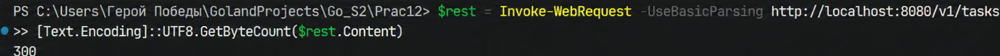
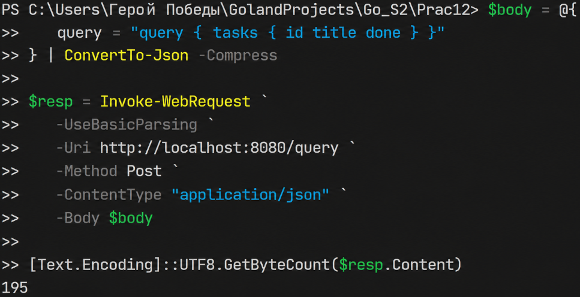
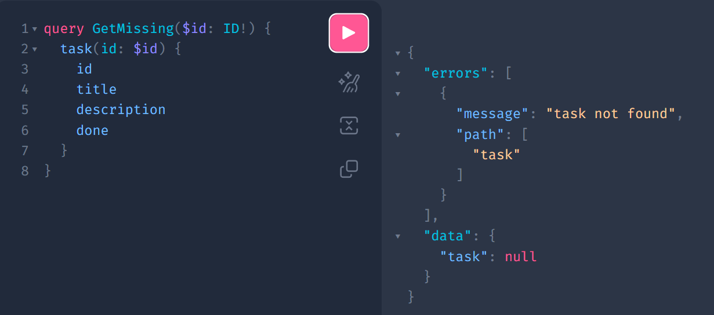

# Практическая работа №12 — Сравнение REST и GraphQL


**ФИО: Пряшников Дмитрий Максимович**  
**Группа: ПИМО-01-25**

Реализация одного и того же функционала (Task) двумя способами: классический REST и GraphQL (gqlgen). Сравнение по количеству запросов, объёму данных, скорости, обработке ошибок, кэшированию и удобству сопровождения.

---

## Цель работы

Освоить практическое сравнение REST и GraphQL на примере одного и того же прикладного сценария, научиться реализовывать одинаковый функционал двумя подходами, анализировать различия в структуре запросов и ответов, а также делать обоснованный вывод о целесообразности использования каждого из подходов в backend-разработке.

---

## Выполненные задачи

- Разработан **общий сервисный слой** `internal/task.Service` для обеих API.
- Реализован **REST API** с эндпоинтами:  
  `GET /v1/tasks`, `GET /v1/tasks/{id}`, `POST /v1/tasks`, `PATCH /v1/tasks/{id}`.
- Реализован **GraphQL API** на gqlgen: схема, резолверы, Playground.
- Подготовлен **единый сценарий сравнения** (список → детали → обновление).
- Проведено сравнение по 6 критериям: количество запросов, объём данных, скорость, ошибки, документирование, кэширование.
- Написан **unit-тест** для сервисного слоя.
- Создан **скрипт замера скорости** (`compare_speed.ps1`) для 1000 итераций.
- Оформлена итоговая таблица и развёрнутый вывод.

---

## Структура проекта

```text
Prac12/
├── cmd/server/main.go              # Точка входа, HTTP‑сервер
├── graph/                          # GraphQL схема, резолверы, gqlgen code
├── internal/rest/handler.go        # REST‑обработчики
├── internal/task/service.go        # Общий сервисный слой
├── internal/task/service_test.go   # Unit‑тест
├── scripts/compare_speed.ps1       # Замер скорости (1000 запросов)
├── gqlgen.yml
├── go.mod
└── README.md
```

---

## Запуск

```powershell
cd tech-ip-sem2-gql-vs-rest
go run ./cmd/server
```

После запуска доступны:

- **REST**: `http://localhost:8080/v1/tasks`
- **GraphQL Playground**: `http://localhost:8080/`
- **GraphQL endpoint**: `http://localhost:8080/query`

Проверка тестов:

```powershell
go test ./...
```

---

## Единый сценарий сравнения

Чтобы сравнение было корректным, зафиксирован один и тот же пользовательский сценарий:

1. **Экран списка задач** — нужны поля `id`, `title`, `done`.
2. **Экран деталей задачи** — нужны поля `id`, `title`, `description`, `done`.
3. **Действие изменения** — создание новой задачи и обновление поля `done`.

Это позволяет сравнивать не разные проекты, а одинаковые потребности клиента.

---

## Сравнение количества запросов

Для сценария `список → детали → обновить done` количество сетевых обращений одинаковое.

| REST | GraphQL |
|------|---------|
| `GET /v1/tasks` | `query { tasks { id title done } }` |
| `GET /v1/tasks/{id}` | `query GetTask($id: ID!) { task(id: $id) { id title description done } }` |
| `PATCH /v1/tasks/{id}` | `mutation Update(...)` |

**Вывод:** в простом CRUD‑сценарии GraphQL **не уменьшает** число запросов автоматически. Его преимущество — в точности структуры данных, а не в количестве обращений.

---

## Сравнение скорости (замер over‑fetching)

Для наглядного измерения влияния лишних данных был проведён тест: 1000 раз подряд запрашивается **только список идентификаторов** задач.

- **REST** возвращает все поля (`id, title, description, done`).
- **GraphQL** запрашивает только `id`.

Скрипт: `scripts/compare_speed.ps1`

```powershell
.\scripts\compare_speed.ps1 -Iterations 1000
```

Результат:



**Вывод:** GraphQL оказался быстрее, потому что передавал меньше данных. Однако разница небольшая, так как объём ответа отличался незначительно. Значит, GraphQL‑надстройка даёт реальную пользу только в сценариях со сложными объектами или большим количеством полей.

---

## Сравнение объёма данных

Сравнение выполнено на реальных ответах локального сервера.

### Экран списка (нужны `id, title, done`)

- **REST** (возвращает все поля, включая `description`):  
    
  Размер: **300 байт** (over‑fetching)
- **GraphQL** (запрошены только нужные поля):  
    
  Размер: **195 байт**

**Вывод:** классический пример `over‑fetching` в REST. GraphQL позволяет отдавать ровно то, что нужно клиенту.

### Экран деталей (нужны все поля `id, title, description, done`)

- **REST**: **157 байт**
- **GraphQL**: **174 байта** (добавляется обёртка `data`)

**Вывод:** когда нужен весь объект целиком, выигрыш GraphQL по объёму исчезает, а иногда даже появляется небольшой оверхед из‑за структуры ответа.

---

## Сравнение обработки ошибок

### REST

Запрос несуществующей задачи:

```powershell
Invoke-WebRequest -UseBasicParsing http://localhost:8080/v1/tasks/unknown
```

Результат: HTTP‑статус `404 Not Found`, тело `{"error":"task not found"}`.  
Ошибка очевидна и проста для анализа.

### GraphQL

Тот же запрос (через Playground):



HTTP‑статус остаётся `200 OK`, ошибка передаётся в поле `errors`.  
Клиент должен дополнительно парсить `errors`, что менее интуитивно для новичков.

**Вывод:** REST проще для понимания ошибок, так как использует стандартные HTTP‑статусы. GraphQL требует отдельной обработки поля `errors`, но позволяет вернуть частичный результат вместе с ошибкой.

---

## Документирование и тестирование

| Аспект | REST | GraphQL |
|--------|------|---------|
| **Наглядность** | Отдельные URL, методы GET/POST/PATCH | Один endpoint, нужно знать схему |
| **Инструменты** | Swagger/OpenAPI, curl, Postman | Playground (встроенная документация) |
| **Простота для начинающих** | Высокая (понятно по URL, что делаешь) | Средняя (надо освоить query, mutation, переменные) |
| **Самодокументируемость** | Требует отдельной генерации (Swagger) | Встроена в схему, Playground показывает всё |

**Вывод:** для быстрого CRUD и учебных задач REST проще. Для API, которое должно само себя документировать и давать гибкость, GraphQL удобнее.

---

## Кэширование (концептуально)

- **REST** — кэширование по URL и HTTP‑методу работает «из коробки» (браузер, CDN, прокси).
- **GraphQL** — единый endpoint и POST‑запросы ломают стандартное кэширование. Требуются дополнительные решения: client‑side cache (Apollo Client), persisted queries, кэширование на уровне данных.

**Вывод:** для простых API REST выигрывает по простоте организации кэша.

---

## Итоговая таблица сравнения

| Критерий | REST | GraphQL |
|----------|------|---------|
| **Структура API** | Несколько endpoint | Один endpoint |
| **Выбор полей** | Определяет сервер | Определяет клиент |
| **Избыточность ответа** | Возможна (over‑fetching) | Обычно ниже |
| **Количество запросов в сценарии** | 3 | 3 |
| **Обработка ошибок** | HTTP‑статусы + JSON | Поле `errors` (HTTP 200) |
| **Кэширование** | Проще (стандартный HTTP) | Сложнее (нужны доп. механизмы) |
| **Простота внедрения** | Выше (без генерации кода) | Ниже (схема, резолверы, gqlgen) |
| **Гибкость для клиента** | Ниже | Выше |

---

## Итоговый вывод

На выбранном сценарии (список → детали → обновление) REST и GraphQL решают одну и ту же задачу, но делают это по‑разному. Количество запросов оказалось одинаковым, поэтому GraphQL не стоит считать «волшебной таблеткой» для сокращения сетевых обращений. Основное преимущество GraphQL в этой работе проявилось на экране списка задач: клиенту нужны были только три поля, а REST вернул ещё и `description` — классический over‑fetching. GraphQL позволил запросить только нужные поля и уменьшить объём ответа на ~35%. Однако для экрана деталей, где требовались все поля, выигрыш исчез, а GraphQL даже добавил небольшой оверхед из‑за обёртки `data`.

REST оказался проще по маршрутам, обработке ошибок (404 вместо анализа поля `errors`) и кэшированию. GraphQL дал большую гибкость, но потребовал отдельной схемы, кодогенерации и более внимательного отношения к ошибкам. Тест скорости (1000 запросов только идентификаторов) показал, что GraphQL может быть быстрее за счёт меньшего объёма данных, но разница невелика.

Поэтому для внутренних CRUD‑сервисов, учебных проектов и административных API REST остаётся более рациональным выбором. GraphQL имеет смысл применять там, где есть несколько типов клиентов (веб, мобилка, IoT), сложные экраны с вложенными данными и жёсткие требования к точности передаваемых полей.

**Важно понимать:** объём данных между backend‑сервисом и базой данных (если бы она была) остаётся одинаковым в обоих случаях. Оптимизация только на стыке backend ↔ frontend не решит проблемы высокой нагрузки на уровне базы данных.

---

## Контрольные вопросы


### 1. В чём принципиальное отличие REST и GraphQL?

REST — архитектурный стиль, использующий множество URL (каждый ресурс — свой) и HTTP‑методы (GET, POST, PATCH, DELETE). Сервер фиксирует структуру ответа. GraphQL — язык запросов, использующий один endpoint, метод POST, а клиент сам описывает нужные поля и вложения.

### 2. Что такое over‑fetching и under‑fetching?

**Over‑fetching** — сервер возвращает больше данных, чем нужно клиенту (например, лишнее поле `description` в списке задач). **Under‑fetching** — одного запроса недостаточно, приходится делать несколько (например, сначала список задач, потом детали каждой). GraphQL позволяет избежать обеих проблем.

### 3. Почему GraphQL позволяет клиенту точнее выбирать поля ответа?

Запрос GraphQL — это не просто имя операции, а полное описание структуры ответа. Сервер анализирует запрошенные поля и возвращает только их. В REST разработчик сервера заранее определяет набор полей, и клиент не может его изменить.

### 4. Почему REST проще кэшировать стандартными средствами HTTP?

HTTP‑кэширование опирается на URL и метод запроса. В REST каждый ресурс имеет свой URL, GET‑запросы идемпотентны. Кэш (браузер, CDN) может легко сохранить `GET /v1/tasks/1` по ключу URL. В GraphQL все запросы идут на один URL, используют POST, а тело запроса меняется — кэш не может понять, что это разные данные.

### 5. Чем отличается обработка ошибок в REST и GraphQL?

- **REST** — ошибка выражается через HTTP‑статус (404, 400, 500) и тело ответа (JSON с описанием).
- **GraphQL** — даже при ошибке часто возвращается HTTP 200, а ошибка передаётся в специальном поле `errors`. Это позволяет вернуть частичный результат вместе с ошибкой, но менее интуитивно для начинающих.

### 6. В каких случаях REST оказывается более практичным решением?

- Простые CRUD‑сервисы с небольшим количеством сущностей.
- Внутренние административные API, где избыточность полей не критична.
- Когда нужна быстрая разработка без генерации кода.
- Когда важна интеграция со стандартными HTTP‑механизмами (кэширование, мониторинг по статусам).
- Учебные проекты (REST понятнее студентам).

### 7. В каких случаях GraphQL может дать преимущества?

- Несколько клиентов (веб, мобилка, IoT) с разными наборами полей.
- Сложные экраны с вложенными данными (задача + автор + комментарии) — можно получить всё за один запрос.
- Часто меняющийся фронтенд — бэкенд не нужно переделывать при добавлении/удалении полей.
- API как продукт — самодокументируемая схема, Playground, автодополнение.

### 8. Почему корректное сравнение REST и GraphQL нужно проводить на одном и том же сценарии?

Если сравнивать разные сценарии (например, REST для списка, а GraphQL для деталей), то различия могут быть вызваны не технологией, а разными требованиями. Только при одинаковых «входных условиях» (нужный набор полей, операции) можно честно сравнить количество запросов, объём данных, удобство ошибок и т.д.

### 9. Какие сложности возникают при сопровождении GraphQL API?

- Поддержка схемы и резолверов — изменение модели требует перегенерации кода.
- N+1 проблема — без DataLoader резолвер списка может сделать отдельный запрос к БД для каждого элемента.
- Отсутствие стандартного HTTP‑кэширования — нужен клиентский кэш или persisted queries.
- Мониторинг сложнее — поле `errors` не даёт привычных HTTP‑статусов.
- Безопасность — нужно ограничивать глубину и сложность запросов (DoS‑атаки).

### 10. Почему для учебных CRUD-сервисов REST часто оказывается проще?

- Меньше кода — не нужна схема, кодогенерация, резолверы.
- Понятные ошибки — HTTP‑статусы (404, 400) вместо парсинга `errors`.
- Простая отладка — `curl http://localhost:8080/v1/tasks/1` сразу даёт ответ.
- Наглядная структура API — отдельные URL под каждый ресурс и метод.
- Быстрый старт — не нужно изучать синтаксис GraphQL (типы, query, mutation, переменные).

---

## Типичные ошибки

| Ошибка | Проявление | Решение |
|--------|------------|---------|
| **GraphQL всегда уменьшает число запросов** | В простом CRUD‑сценарии запросов столько же, сколько в REST | Понимать, что преимущество — в структуре, а не в количестве |
| **Не добавлен jitter для TTL** | (из ПЗ9) — здесь не актуально, но в кэше важно | — |
| **REST возвращает лишние поля** | Over‑fetching на экране списка | Использовать GraphQL или делать отдельные эндпоинты под разные экраны |
| **GraphQL‑ошибка с HTTP 200** | Клиент не проверяет поле `errors` и думает, что всё ок | Всегда анализировать `errors` в ответе GraphQL |
| **Забыт DataLoader** | N+1 запросов к БД при запросе списка | Внедрить DataLoader для пакетной загрузки |
| **Сравнение разных сценариев** | Сравнивается REST для одной сущности, GraphQL для другой | Фиксировать единый сценарий до начала разработки |
```