# Практическое занятие №15 — Деплой приложения на VPS. Настройка systemd


**ФИО: Пряшников Дмитрий Максимович**  
**Группа: ПИМО-01-25**

Развёртывание Go-сервиса `tasks` на удалённом Linux VPS: сборка Linux-бинарника, настройка окружения, создание systemd-юнита, управление сервисом, логирование, обновление и откат.

---

## Цель работы

Освоить публикацию backend-приложения на удалённом Linux-сервере, научиться подключаться к VPS по SSH, размещать исполняемый файл приложения, настраивать переменные окружения, создавать unit-файл systemd, управлять сервисом через systemctl, анализировать логи через journalctl и выполнять базовую процедуру обновления версии приложения.

---

## Выполненные задачи

- Подключение к VPS по SSH.
- Обновление пакетов и создание отдельного пользователя `tasksuser`.
- Создание директорий `/opt/tasks` и `/etc/tasks`.
- Подготовка конфигурационного файла `tasks.env` с безопасными правами (600).
- Кросс-компиляция Linux-бинарника (`GOOS=linux GOARCH=amd64`).
- Копирование бинарника на VPS через `scp` и размещение в `/opt/tasks/tasks`.
- Создание unit-файла `/etc/systemd/system/tasks.service`.
- Запуск сервиса через `systemctl`, включение автозапуска.
- Проверка статуса, просмотр логов через `journalctl`.
- Проверка доступности `/health` через `curl` локально и с другой машины.
- Обновление версии (замена бинарника, restart) и откат на старую версию.
- Демонстрация базовых команд управления сервисом.

---

## Структура на VPS

```text
/opt/tasks/
├── tasks              # исполняемый бинарник
└── tasks.old          # резервная копия (после обновления)

/etc/tasks/
└── tasks.env          # переменные окружения (права 600, владелец root)

/etc/systemd/system/
└── tasks.service      # unit-файл systemd
```

---

## Пошаговое выполнение

### 1. Подключиться к VPS по SSH

```bash
ssh user@<VPS_IP>
```


### 2. Обновить пакеты на сервере

```bash
sudo apt update && sudo apt upgrade -y
```

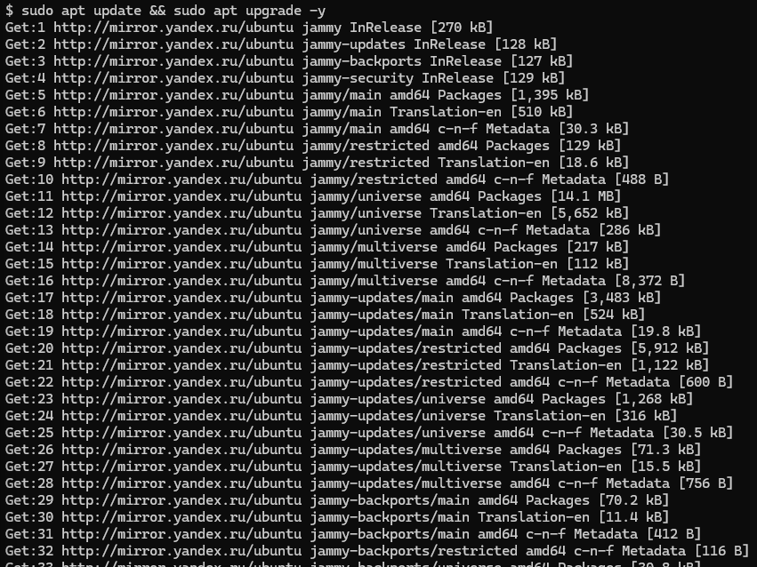

### 3. Создать отдельного пользователя для сервиса

```bash
sudo useradd --system --no-create-home --shell /usr/sbin/nologin tasksuser
```


### 4. Создать директорию приложения

```bash
sudo mkdir -p /opt/tasks
sudo chown -R tasksuser:tasksuser /opt/tasks
```


### 5. Подготовить конфигурационный файл

```bash
sudo mkdir -p /etc/tasks
sudo nano /etc/tasks/tasks.env
```

Содержимое (пример):

```ini
TASKS_PORT=8082
AUTH_BASE_URL=http://127.0.0.1:8081
LOG_LEVEL=info
```

После сохранения — безопасные права:

```bash
sudo chown root:root /etc/tasks/tasks.env
sudo chmod 600 /etc/tasks/tasks.env
```

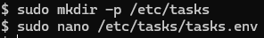


### 6. Собрать Linux-бинарник на локальной машине

```bash
cd services/tasks
GOOS=linux GOARCH=amd64 go build -o bin/tasks ./cmd/tasks
```

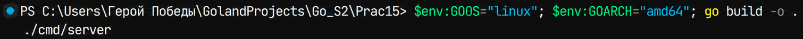

### 7. Скопировать бинарник на VPS

```bash
scp bin/tasks user@<VPS_IP>:/tmp/tasks
```

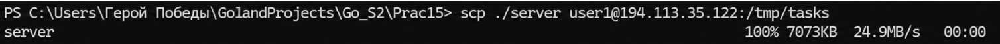

### 8. Переместить бинарник в рабочую директорию

```bash
sudo mv /tmp/tasks /opt/tasks/tasks
sudo chown tasksuser:tasksuser /opt/tasks/tasks
sudo chmod 755 /opt/tasks/tasks
```

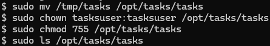

### 9. Создать unit-файл systemd

```bash
sudo nano /etc/systemd/system/tasks.service
```


Содержимое:

```ini
[Unit]
Description=Tasks Service
After=network.target

[Service]
Type=simple
User=tasksuser
WorkingDirectory=/opt/tasks
EnvironmentFile=/etc/tasks/tasks.env
ExecStart=/opt/tasks/tasks
Restart=always
RestartSec=2
NoNewPrivileges=true
LimitNOFILE=65535

[Install]
WantedBy=multi-user.target
```


### 10. Разобрать назначение параметров unit-файла

| Параметр | Значение |
|----------|----------|
| `Description` | Краткое описание службы |
| `After=network.target` | Запускать после инициализации сети |
| `User=tasksuser` | Запуск не от root, а от отдельного пользователя |
| `WorkingDirectory=/opt/tasks` | Рабочая директория приложения |
| `EnvironmentFile=/etc/tasks/tasks.env` | Подключение внешнего файла конфигурации |
| `ExecStart=/opt/tasks/tasks` | Команда запуска приложения |
| `Restart=always` | Всегда перезапускать сервис при аварийном завершении |
| `RestartSec=2` | Подождать 2 секунды перед повторным запуском |
| `NoNewPrivileges=true` | Ограничить получение дополнительных привилегий |
| `LimitNOFILE=65535` | Увеличить лимит открытых файлов |
| `WantedBy=multi-user.target` | Включить службу в обычный многопользовательский режим |

### 11. Перечитать конфигурацию systemd

```bash
sudo systemctl daemon-reload
```


### 12. Запустить сервис

```bash
sudo systemctl start tasks
```


### 13. Включить автозапуск

```bash
sudo systemctl enable tasks
```


### 14. Проверить статус сервиса

```bash
sudo systemctl status tasks
```

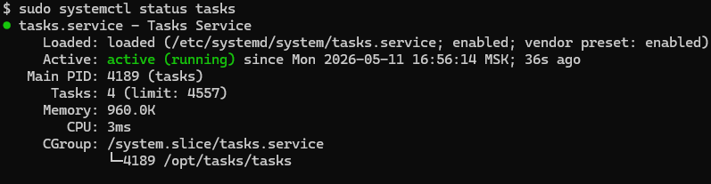

### 15. Посмотреть логи через journalctl

```bash
sudo journalctl -u tasks --no-pager -n 100
sudo journalctl -u tasks -f   # live
```


### 16. Проверить доступность приложения

Локально на VPS:

```bash
curl -i http://127.0.0.1:8082/health
```

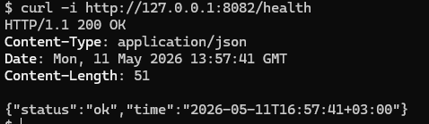

С другого компьютера (если порт открыт):

```bash
curl -i http://<VPS_IP>:8082/health
```

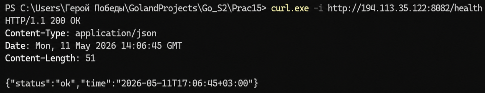

### 17. Зафиксировать базовые команды управления сервисом

| Команда | Действие |
|---------|----------|
| `sudo systemctl start tasks` | Запуск |
| `sudo systemctl stop tasks` | Остановка |
| `sudo systemctl restart tasks` | Перезапуск |
| `sudo systemctl status tasks` | Статус |
| `sudo systemctl disable tasks` | Отключить автозапуск |

### 18. Выполнить обновление версии приложения

```bash
# на локальной машине собрать новый бинарник
GOOS=linux GOARCH=amd64 go build -o bin/tasks_v2 ./cmd/tasks
scp bin/tasks_v2 user@<VPS_IP>:/tmp/tasks

# на VPS
sudo systemctl stop tasks
sudo mv /opt/tasks/tasks /opt/tasks/tasks.old
sudo mv /tmp/tasks /opt/tasks/tasks
sudo chown tasksuser:tasksuser /opt/tasks/tasks
sudo chmod 755 /opt/tasks/tasks
sudo systemctl start tasks
```

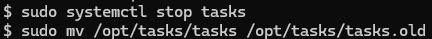
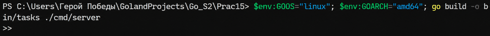
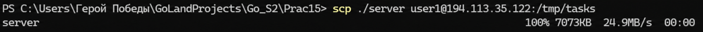
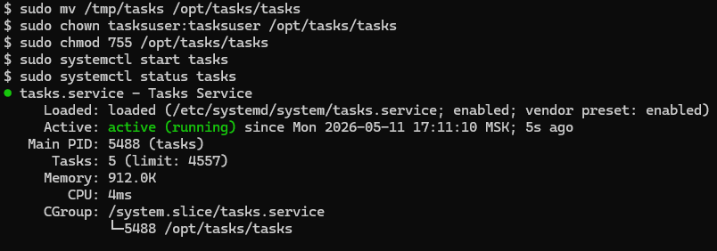

### 19. Выполнить откат при неудачном обновлении

```bash
sudo systemctl stop tasks
sudo mv /opt/tasks/tasks.old /opt/tasks/tasks
sudo systemctl start tasks
```


### 20. Зафиксировать замечание по портам и безопасности

> В реальной эксплуатации приложение слушает `127.0.0.1:8082`, а снаружи работает NGINX на 80/443, который проксирует запросы. Прямое открытие порта допустимо только в учебных целях.

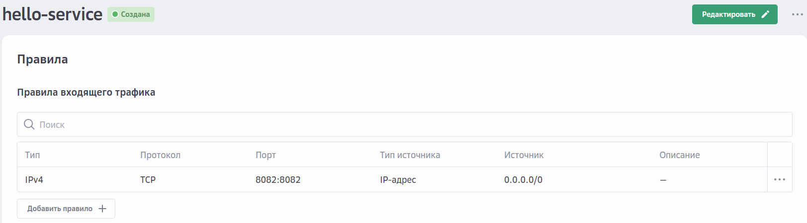

---

## Контрольные вопросы


### 1. Что такое VPS и зачем он нужен backend-разработчику?

**VPS (Virtual Private Server)** — виртуальный выделенный сервер, который работает как полноценная Linux-машина. Backend-разработчику VPS нужен для развёртывания и эксплуатации приложений в сети, чтобы они были доступны пользователям, работали постоянно и не зависели от локальной среды разработки.

### 2. Почему запуск приложения на VPS отличается от локального запуска на компьютере разработчика?

- **Среда** — на VPS другая ОС (обычно Linux без GUI), другие версии пакетов.
- **Сетевые ограничения** — нужно открывать порты, настраивать firewall.
- **Управление процессами** — нельзя просто запустить в терминале, нужен systemd или Docker.
- **Доступность** — сервис должен переживать перезагрузки, сбои и работать без присмотра.

### 3. Для чего используется systemd?

**systemd** — стандартный менеджер служб в Linux. Он позволяет:
- запускать приложение при старте системы (`enable`);
- автоматически перезапускать приложение при падении (`Restart=always`);
- управлять службой (`start`, `stop`, `restart`, `status`);
- централизованно собирать логи (`journalctl`).

### 4. Почему не рекомендуется запускать серверное приложение от root?

- **Безопасность** — при компрометации приложения злоумышленник получит полный контроль над сервером.
- **Ограничение ущерба** — отдельный пользователь имеет права только на свои файлы.
- **Следование best practices** — root должен использоваться только для администрирования, не для работы приложений.

### 5. Зачем выносить конфигурацию в отдельный env-файл?

- **Безопасность** — секреты не попадают в репозиторий и не вшиты в бинарник.
- **Гибкость** — можно менять параметры без перекомпиляции.
- **Удобство эксплуатации** — один бинарник для разных сред (dev, staging, prod).

### 6. Что делает параметр Restart=always?

Указывает systemd, что при любом аварийном завершении процесса (ненулевой код возврата, паника, сигнал) службу нужно перезапустить автоматически. Это обеспечивает самовосстановление при временных сбоях.

### 7. Для чего нужен EnvironmentFile в unit-файле?

`EnvironmentFile` указывает путь к файлу, из которого systemd прочитает переменные окружения и передаст их запущенному процессу. Это позволяет отделить конфигурацию от команды запуска и держать секреты вне юнит-файла.

### 8. Как проверить состояние службы через systemctl?

```bash
sudo systemctl status tasks
```

Вывод показывает: активна ли служба (`active (running)`), PID, время запуска, последние логи, а также состояние автозапуска (`enabled`/`disabled`).

### 9. Как посмотреть логи сервиса через journalctl?

```bash
sudo journalctl -u tasks -n 100        # последние 100 строк
sudo journalctl -u tasks -f            # live mode (follow)
```

`journalctl` собирает stdout и stderr сервиса, что очень удобно для диагностики.

### 10. Что нужно сделать перед обновлением unit-файла systemd?

После любого изменения файла `.service` необходимо выполнить:

```bash
sudo systemctl daemon-reload
```

Это заставляет systemd перечитать все юнит-файлы и применить новые настройки. Без этого изменения не вступят в силу.

### 11. Почему полезно иметь процедуру отката версии?

Обновление может принести критические ошибки (не стартует, падает при нагрузке). Откат позволяет быстро вернуть рабочую версию без пересборки и перезаливки, минимизируя время простоя сервиса. В работе откат делается через переименование `tasks.old` → `tasks`.

### 12. Зачем в реальных системах часто используют NGINX перед приложением?

- **Безопасность** — NGINX работает от непривилегированного пользователя, умеет ограничивать соединения, скрывает внутренний порт.
- **SSL/TLS терминация** — HTTPS заканчивается на NGINX, к приложению идёт HTTP.
- **Балансировка нагрузки** — NGINX может распределять запросы между несколькими экземплярами.
- **Статика и кэширование** — NGINX эффективно отдаёт статические файлы и кэширует ответы.
- **Централизованное логирование** — все логи запросов собираются в одном месте.

---

## Типичные ошибки

| Ошибка | Проявление | Решение |
|--------|------------|---------|
| **Бинарник не имеет прав на выполнение** | `systemctl status` показывает `exit code 203` или `Exec format error` | `sudo chmod 755 /opt/tasks/tasks` |
| **Ошибка при запуске: порт уже занят** | Приложение не может слушать `:8082` | Проверить, не запущено ли другое приложение на этом порту (`ss -tlnp`) |
| **Сервис не стартует после перезагрузки** | Автозапуск не включён | `sudo systemctl enable tasks` |
| **Логи пустые, хотя сервис запущен** | Вывод идёт не в stdout/stderr, а в файл | Убедиться, что приложение пишет логи в `os.Stdout`, а не в свой файл |
| **EnvironmentFile не загружается** | Переменные окружения не видны в приложении | Проверить путь и права на файл (`sudo chmod 600 /etc/tasks/tasks.env`) |
| **При обновлении бинарник остаётся старым** | `systemctl restart` не помог, версия не обновилась | Остановить сервис, заменить бинарник, запустить снова (иногда требуется `daemon-reload`) |
| **Отказ от root, но файлы принадлежат root** | Пользователь `tasksuser` не может читать бинарник или env | `chown tasksuser:tasksuser /opt/tasks/tasks` и для конфига — либо root, либо добавить пользователя в группу |