# Практическое занятие №16 — Публикация приложения в Kubernetes


**ФИО: Пряшников Дмитрий Максимович**  
**Группа: ПИМО-01-25**

Развёртывание контейнеризированного Go-сервиса `tasks` в Kubernetes: Deployment, Service, ConfigMap, readiness/liveness probes, проверка через `kubectl` и `port-forward`.

---

## Цель работы

Освоить базовую публикацию контейнеризированного backend-приложения в Kubernetes, научиться описывать Deployment и Service, передавать конфигурацию через ConfigMap, настраивать readiness и liveness probes, применять манифесты через kubectl и проверять состояние Pod и Service.

---

## Выполненные задачи

- Создан минимальный HTTP-сервис `tasks` с эндпоинтом `/health`.
- Написан `Dockerfile` и собран образ `techip-tasks:0.1`.
- Образ загружен в `minikube` (или другой локальный кластер).
- Создан **ConfigMap** с переменными окружения (`TASKS_PORT`, `AUTH_BASE_URL`, `LOG_LEVEL`).
- Написан **Deployment** с одной репликой, с указанием образа, портов и probes.
- Настроены **readinessProbe** и **livenessProbe** (HTTP GET `/health`).
- Создан **Service** типа `ClusterIP`.
- Проверены `kubectl get pods`, `describe`, `logs`.
- Выполнен `port-forward` и проверен `GET /health`.
- Продемонстрировано масштабирование до 2 реплик и обратно.
- Все ресурсы удалены после завершения работы.

---

## Структура проекта

```text
Prac16/
├── services/
│   └── tasks/
│       ├── .dockerignore
│       ├── Dockerfile
│       ├── go.mod
│       └── cmd/
│           └── tasks/
│               └── main.go          # HTTP-сервер + /health
├── deploy/
│   └── k8s/
│       ├── configmap.yaml           # переменные окружения
│       ├── deployment.yaml          # Deployment + probes
│       └── service.yaml             # ClusterIP Service
└── README.md
```

---

## Подготовка образа

```powershell
cd services/tasks
docker build -t techip-tasks:0.1 .
```

Для `minikube`:

```powershell
minikube image load techip-tasks:0.1
```

---

## Проверка доступа к кластеру

```powershell
kubectl cluster-info
kubectl get nodes
```

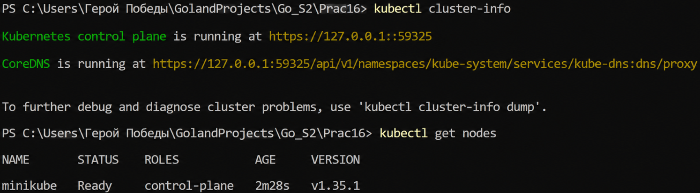

---

## Применение манифестов

```powershell
kubectl apply -f deploy/k8s/configmap.yaml
kubectl apply -f deploy/k8s/deployment.yaml
kubectl apply -f deploy/k8s/service.yaml
```

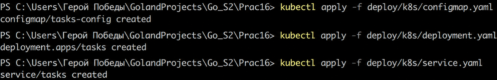

---

## Проверка Pod

```powershell
kubectl get pods
kubectl describe pod <pod-name>
```

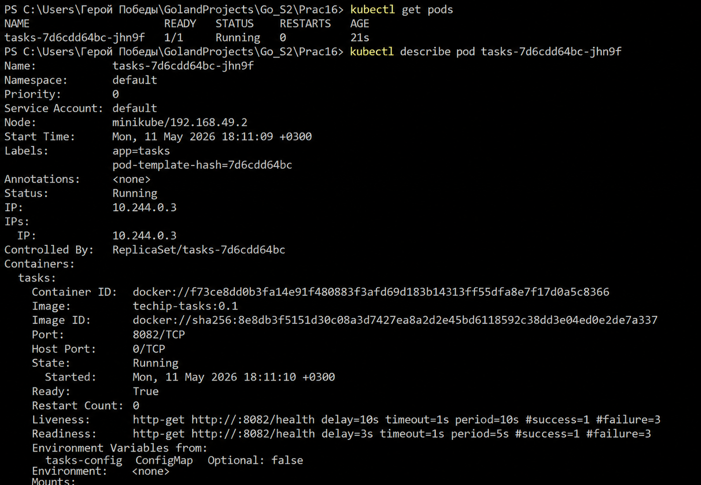

---

## Проверка Deployment

```powershell
kubectl get deployment
kubectl describe deployment tasks
```

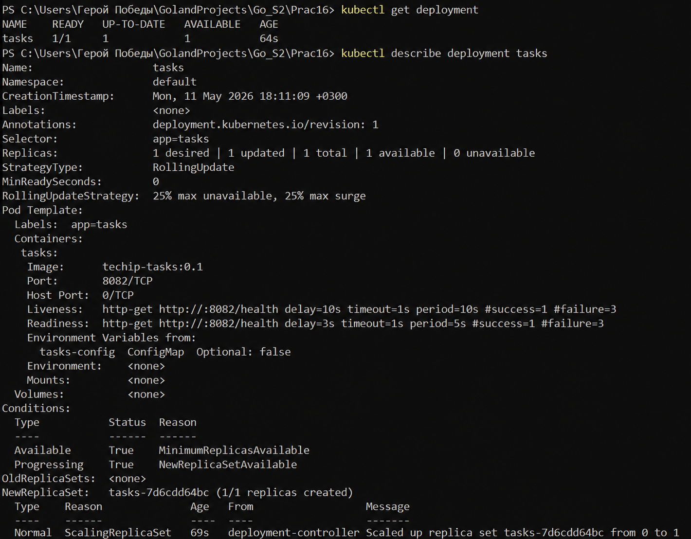

---

## Проверка Service

```powershell
kubectl get svc
kubectl describe svc tasks
```

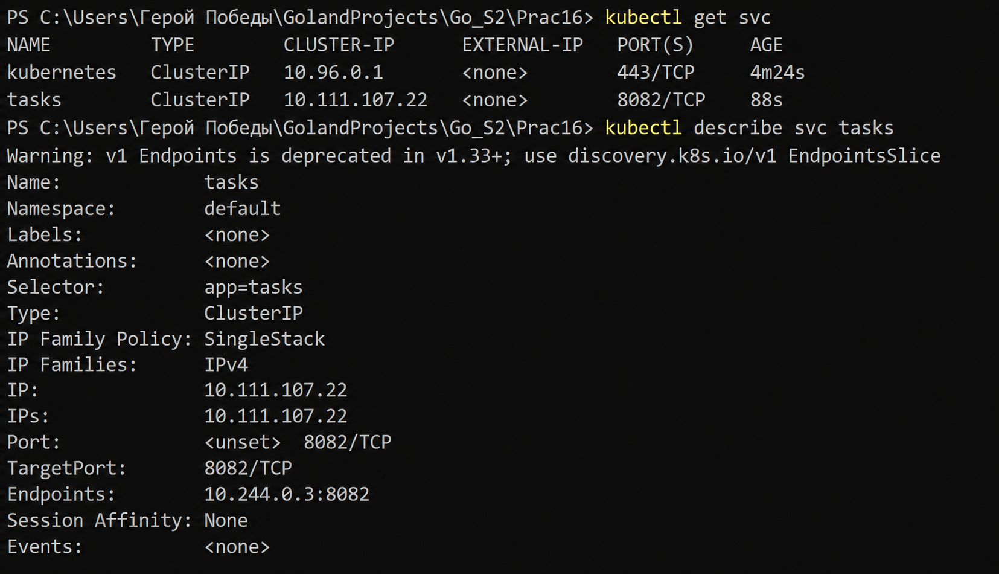

---

## Логи контейнера

```powershell
kubectl logs <pod-name>
```

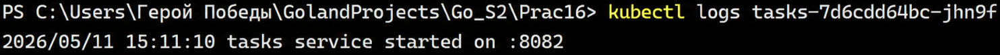

---

## Доступ через port-forward

Терминал 1:

```powershell
kubectl port-forward svc/tasks 8082:8082
```

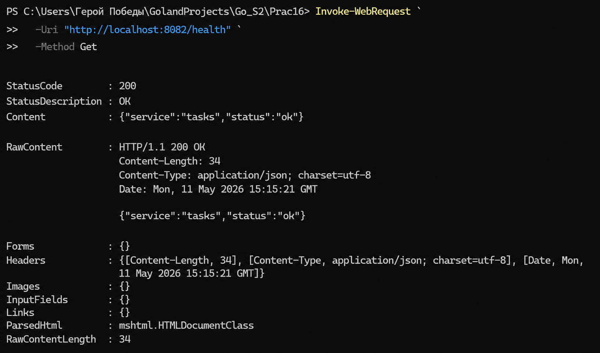

Терминал 2:

```powershell
Invoke-WebRequest -Uri "http://localhost:8082/health" -Method Get
```

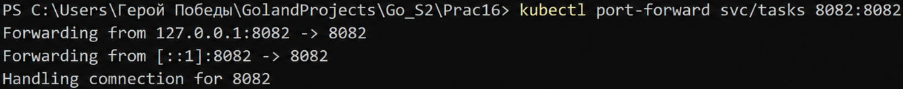

---

## Проверка readiness и liveness

```powershell
kubectl get pods
kubectl describe pod <pod-name>
```

В описании Pod будут видны параметры проб и их статусы.


---

## Масштабирование

Увеличим число реплик до 2:

```powershell
kubectl scale deployment tasks --replicas=2
kubectl get pods
```

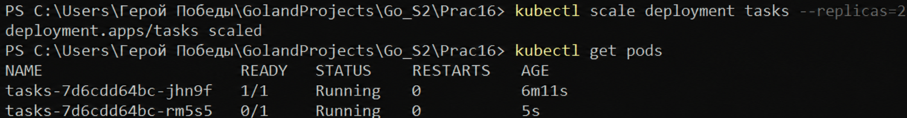

Вернём обратно:

```powershell
kubectl scale deployment tasks --replicas=1
kubectl get pods
```

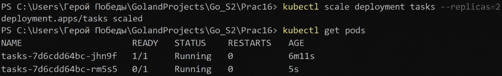

---

## Удаление ресурсов

```powershell
kubectl delete -f deploy/k8s/service.yaml
kubectl delete -f deploy/k8s/deployment.yaml
kubectl delete -f deploy/k8s/configmap.yaml
```

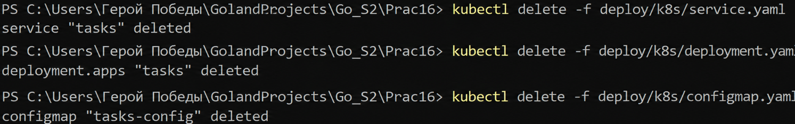

---

## Контрольные вопросы


### 1. Что такое Kubernetes и для чего он используется?

**Kubernetes (K8s)** — это система оркестрации контейнеров. Она автоматизирует развёртывание, масштабирование и управление контейнеризированными приложениями. K8s решает задачи:
- запуск контейнеров на кластере узлов;
- поддержание заданного числа экземпляров (self‑healing);
- распределение нагрузки (Service);
- конфигурирование (ConfigMap, Secrets);
- проверки готовности и жизнеспособности (probes).

### 2. Чем Pod отличается от Deployment?

- **Pod** — минимальная единица развёртывания, один или несколько контейнеров с общим сетевым окружением. Pod создаётся, но если он умрёт — его никто не восстановит.
- **Deployment** — контроллер более высокого уровня, который управляет группой Pod. Он описывает желаемое состояние: сколько реплик, какой образ, как обновляться. Если Pod упадёт, Deployment создаст новый.

### 3. Почему приложение в Kubernetes обычно публикуют через Deployment, а не через одиночный Pod?

Потому что Pod не обеспечивает **самовосстановления**. Если Pod завершится с ошибкой или будет удалён, он не пересоздастся автоматически. Deployment же постоянно следит за числом работающих Pod и при отклонении приводит состояние к желаемому. Это основа надёжности в продакшене.

### 4. Зачем нужен Service и почему нельзя строить обращение к приложению напрямую через Pod?

Pod в Kubernetes эфемерен: его имя, IP-адрес и даже существование могут меняться при перезапусках, масштабировании или обновлениях. **Service** предоставляет стабильный DNS‑имя и IP, через которые можно обращаться к приложению, а также балансирует нагрузку между несколькими Pod одной группы. Без Service клиентам пришлось бы вручную отслеживать меняющиеся адреса Pod.

### 5. Что такое ConfigMap?

**ConfigMap** — объект Kubernetes для хранения несекретных конфигурационных данных в виде пар «ключ‑значение». Эти данные можно подключать в Pod как переменные окружения, файлы в томе или аргументы командной строки. ConfigMap отделяет конфигурацию от образа, позволяя использовать один образ в разных средах.

### 6. Чем ConfigMap отличается от Secret?

- **ConfigMap** хранит обычные, несекретные данные (порты, уровни логирования, URL). Хранится в открытом виде.
- **Secret** предназначен для конфиденциальной информации: паролей, токенов, ключей. Данные кодируются в base64, а в кластере могут быть зашифрованы. Secret имеет более строгие права доступа.

### 7. Для чего используется readiness probe?

**Readiness probe** определяет, готов ли контейнер принимать трафик. Если проба не проходит, Service не направляет запросы на этот Pod. Это полезно, когда приложению нужно время на инициализацию (прогрев кэша, установка соединений). В работе используется HTTP GET `/health` с `initialDelaySeconds: 3`.

### 8. Для чего используется liveness probe?

**Liveness probe** проверяет, жив ли контейнер, не завис ли он. Если проба начинает стабильно проваливаться, Kubernetes перезапускает контейнер. Это помогает восстанавливаться после deadlock’ов или зависаний. В работе также используется `/health`, но с большим `initialDelaySeconds: 10`.

### 9. Почему важно использовать фиксированный тег образа, а не только latest?

Тег `latest` не фиксирует конкретную версию. При каждом перезапуске Pod может подтянуться новая версия образа, что приводит к недетерминированному поведению и сложностям с откатом. Фиксированный тег (например `techip-tasks:0.1`) позволяет точно знать, какая версия приложения запущена, и контролировать обновления.

### 10. Зачем нужен kubectl port-forward?

`kubectl port-forward` создаёт туннель от локального порта к порту Pod или Service внутри кластера. Это позволяет разработчику тестировать приложение локально, не публикуя Service наружу (например, через LoadBalancer). В работе используется `port-forward svc/tasks 8082:8082` для доступа к `/health`.

### 11. Что делает команда kubectl scale deployment --replicas=?

Команда изменяет желаемое количество реплик в Deployment. Kubernetes автоматически создаст или удалит Pod, чтобы достичь указанного числа. В работе с помощью `scale` мы увеличили число реплик с 1 до 2, а затем вернули обратно.

### 12. Почему публикация приложения в Kubernetes считается декларативной?

Вместо императивных инструкций («создай Pod, потом Service, потом...») разработчик описывает **желаемое состояние** в YAML‑манифестах: сколько реплик, какой образ, какие порты и пробы. Kubernetes же берёт на себя задачу привести текущее состояние к желаемому. Это подход «декларативный», в отличие от скриптов с последовательными командами.

---

## Типичные ошибки

| Ошибка | Проявление | Решение |
|--------|------------|---------|
| **Образ не загружен в кластер** | Pod в статусе `ImagePullBackOff` или `ErrImagePull` | Использовать `minikube image load`, `kind load docker-image` или залить в registry |
| **Не задан containerPort** | Service не может маршрутизировать трафик | Указать `containerPort: 8082` в Deployment |
| **Probes настроены на неправильный порт** | Pod вечно в состоянии `Starting` или перезапускается | Проверить, что `port` в probes совпадает с `containerPort` и портом, который слушает приложение |
| **ConfigMap не подключен через envFrom** | Переменные окружения не передаются в контейнер | В Deployment добавить `envFrom` -> `configMapRef` |
| **selector в Service не совпадает с labels Pod** | Service не направляет трафик, `kubectl get endpoints` пуст | Убедиться, что `spec.selector` в Service и `spec.template.metadata.labels` в Deployment одинаковы (`app: tasks`) |
| **Забыт .dockerignore** | Образ раздувается, включает ненужные файлы | Добавить `.dockerignore` с исключениями `.git`, `*.log`, `tmp` |
| **Нельзя выполнить port-forward** | Ошибка `unable to forward because service not running` | Проверить, что Pod в статусе `Running`, а Service создан и имеет endpoints |
