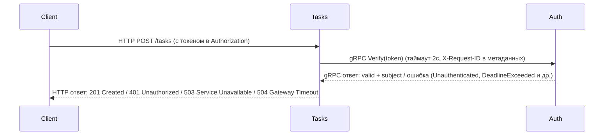
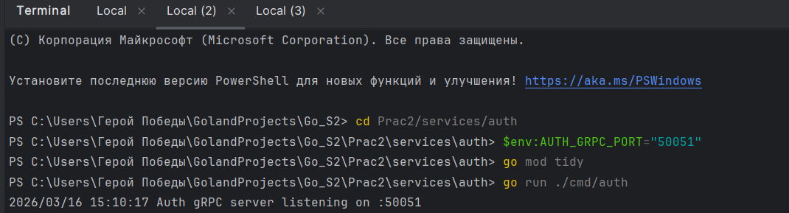
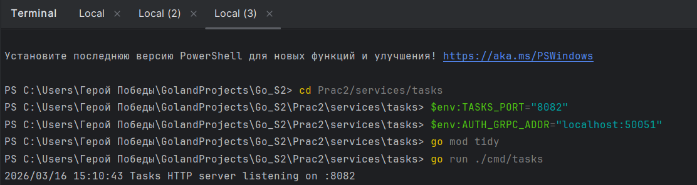
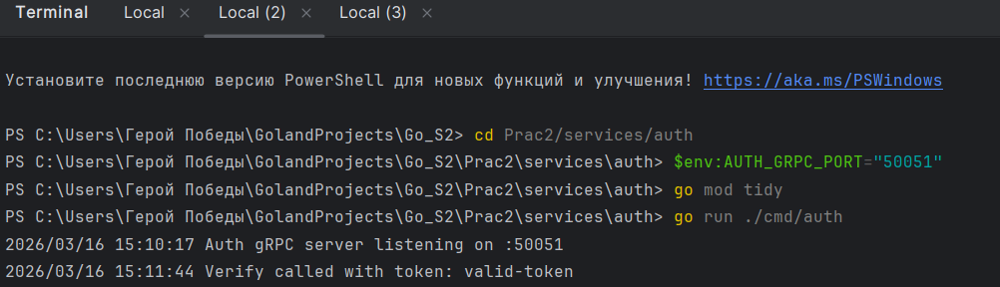
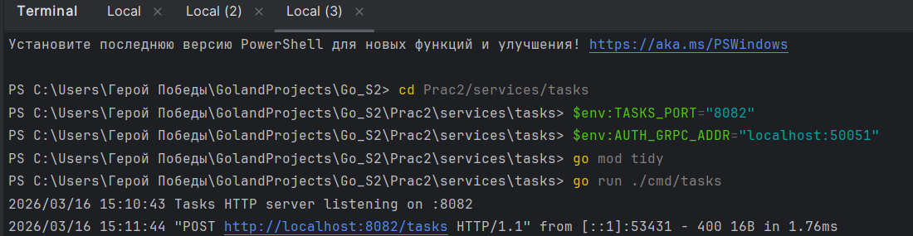
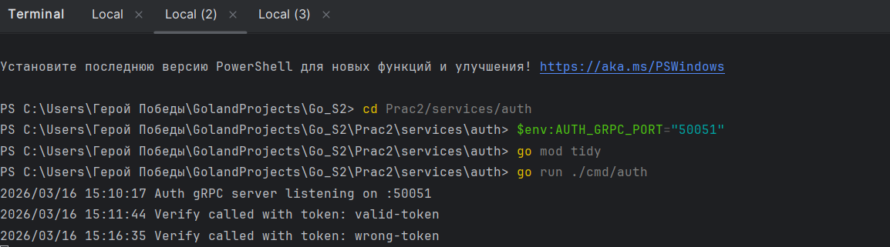
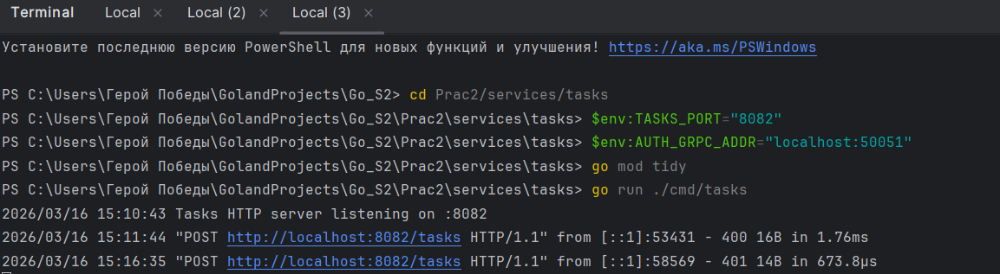
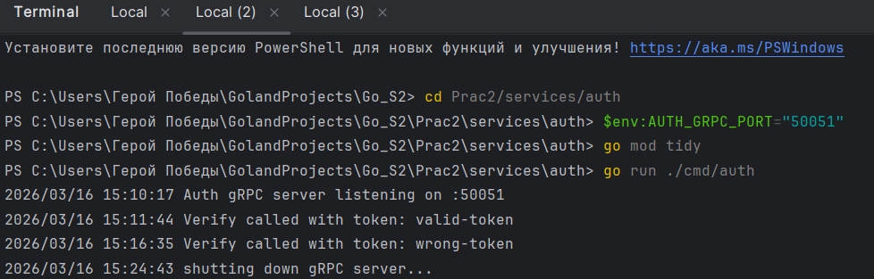
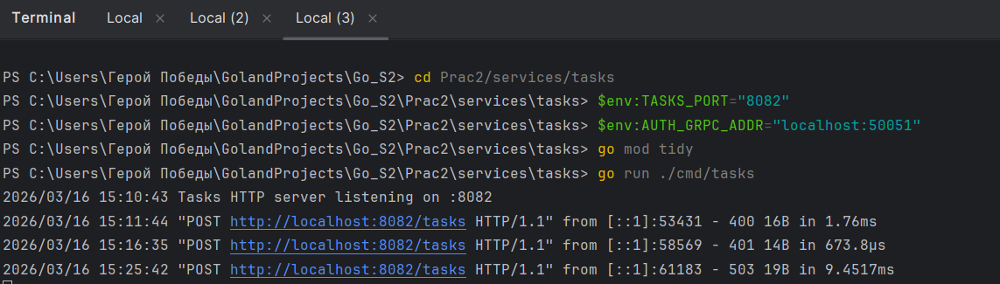

# Практическое занятие №2

ФИО: Пряшников Дмитрий Максимович
Группа: ПИМО-01-25
## Описание решения

Проект состоит из двух микросервисов, взаимодействующих по **gRPC**:
- **Auth service** – gRPC сервер, реализующий метод `Verify` для проверки токена. В демо-режиме считает валидным только токен `"valid-token"`.
- **Tasks service** – HTTP API (REST) для управления задачами. Каждый защищённый запрос проходит через middleware, который вызывает gRPC метод `Verify` в Auth service с таймаутом 2 секунды.

Код генерируется из единого `.proto` контракта, что гарантирует строгую типизацию и согласованность данных между сервисами. При недоступности Auth или превышении таймаута Tasks возвращает клиенту соответствующий HTTP статус (503/504).

## Границы ответственности

- **Auth service**: только проверка токена. Не хранит состояние, не ведёт логов доступа (кроме отладочных). Возвращает gRPC статусы:
  - `codes.Unauthenticated` – невалидный или отсутствующий токен.
  - `codes.Internal` – внутренняя ошибка (не используется в демо).
- **Tasks service**:
  - Публичный эндпоинт `GET /health` для проверки доступности.
  - Защищённый эндпоинт `POST /tasks` для создания задачи (сохраняется в памяти).
  - В middleware извлекает токен из заголовка `Authorization`, вызывает Auth с таймаутом, при успехе сохраняет `subject` (идентификатор пользователя) в контексте запроса.
  - Маппинг gRPC ошибок в HTTP:
    - `Unauthenticated` → 401
    - `DeadlineExceeded` → 504
    - остальные (включая недоступность сервера) → 503

## Требования

- Установленный Go версии 1.21 или выше
- Protocol Buffers компилятор (`protoc`) и плагины `protoc-gen-go`, `protoc-gen-go-grpc`
- (Опционально) Git

## Cхема взаимодействия


**Последовательность обработки запроса**:
1. Tasks получает HTTP POST `/tasks` с заголовком `Authorization: Bearer <token>`.
2. Middleware создаёт контекст с таймаутом 2 секунды и вызывает gRPC метод `AuthService.Verify`.
3. Auth проверяет токен (в демо: `<token>` == `"valid-token"`).
4. Если токен верен, Auth возвращает `valid=true` и `subject=user-123`.
5. Tasks сохраняет задачу в памяти, привязывая её к `subject`, и возвращает клиенту `201 Created`.
6. При любой ошибке (невалидный токен, таймаут, недоступность Auth) Tasks возвращает соответствующий HTTP статус с сообщением об ошибке.

## Структура проекта

```
Prac2//
├── go.mod
├── pkg/
│   └── api/
│       └── auth/              
│           ├── auth.pb.go
│           └── auth_grpc.pb.go
│
├── proto/
│   └── auth.proto            
└── services/
    ├── auth/                  
    │   ├── go.mod
    │   ├── cmd/
    │   │   └── auth/
    │   │       └── main.go
    │   └── internal/
    │       └── server/
    │           └── server.go 
    └── tasks/                  
        ├── go.mod
        ├── cmd/
        │   └── tasks/
        │       └── main.go
        └── internal/
        ├── client/
        │   └── auth_client.go  
        ├── handlers/
        │   └── tasks.go        
        └── middleware/
            └── auth.go         
```
## Описание файлов

| Файл/папка | Назначение |
|------------|------------|
| `go.mod` (корневой) | Корневой модуль проекта, используется для локальных замен (replace) |
| `pkg/api/auth/` | Автоматически сгенерированный код из proto-файла (структуры и gRPC интерфейсы) |
| `Prac2/proto/auth.proto` | Protobuf контракт сервиса аутентификации |
| `services/auth/cmd/auth/main.go` | Точка входа Auth service, запуск gRPC сервера |
| `services/auth/internal/server/server.go` | Бизнес-логика метода Verify |
| `services/tasks/cmd/tasks/main.go` | Точка входа Tasks service, подключение gRPC клиента |
| `services/tasks/internal/client/auth_client.go` | Обёртка для gRPC вызовов к Auth с таймаутом |
| `services/tasks/internal/middleware/auth.go` | Middleware для проверки JWT через gRPC |
| `services/tasks/internal/handlers/tasks.go` | HTTP обработчик создания задачи |

## Запуск проекта

### 1. Сгенерируйте код из proto
Откройте терминал в корневой папке `Go_S2` и выполните:
```bash
protoc --go_out=. --go_opt=paths=source_relative --go-grpc_out=. --go-grpc_opt=paths=source_relative Prac2/proto/auth.proto
```

### 2. Запустите Auth сервис (gRPC сервер)
```bash
cd Prac2/services/auth
export AUTH_GRPC_PORT=50051   # Linux/macOS
# или для PowerShell (Windows):
# $env:AUTH_GRPC_PORT="50051"
go mod tidy
go run ./cmd/auth
```

### 3. Запустите Tasks сервис (HTTP API)
В отдельном терминале:
```bash
cd Prac2/services/tasks
export TASKS_PORT=8082
export AUTH_GRPC_ADDR=localhost:50051
# для PowerShell:
# $env:TASKS_PORT="8082"
# $env:AUTH_GRPC_ADDR="localhost:50051"
go mod tidy
go run ./cmd/tasks
```

После запуска сервер Tasks доступен по адресу: http://localhost:8082

**Ошибки:**
- `401 Unauthorized` – отсутствует или неверный токен
- `503 Service Unavailable` – Auth сервис недоступен
- `504 Gateway Timeout` – превышено время ожидания ответа от Auth

### `GET /health`
Проверка работоспособности (не требует токена).  
Ответ: `OK`

## Проверяем работоспособность 

### Установка плагинов


### Далее запускаем процессы



### Проверка №1




### Проверка №2




### После проверяем отработку программы при выключении сервиса




## Ответы на вопросы


### 1. Что такое .proto и почему он считается контрактом?

**.proto** — это файл, написанный на языке Protocol Buffers, в котором описываются структуры данных (сообщения) и интерфейсы сервисов (методы с их входными и выходными типами). Он считается **контрактом**, потому что:
- Задаёт единственный источник истины для формата обмена данными между сервисами.
- По нему генерируется код для клиента и сервера на разных языках, что гарантирует их совместимость.
- Любые изменения в API начинаются с изменения .proto, после чего генерация кода автоматически распространяет изменения на все компоненты.
- Обеспечивает строгую типизацию и обратную совместимость при правильном расширении.

### 2. Что такое deadline в gRPC и чем он полезен?

**Deadline** (или таймаут) в gRPC — это ограничение по времени, которое клиент устанавливает для выполнения удалённого вызова. Если сервер не успевает ответить до истечения deadline, вызов прерывается с ошибкой `DeadlineExceeded`.

Полезность:
- **Предотвращение зависаний** – клиент не будет ждать ответа бесконечно при сбоях сети или проблемах на сервере.
- **Освобождение ресурсов** – сервер может прекратить обработку запроса, по которому истёк deadline.
- **Контроль качества обслуживания** – позволяет устанавливать максимально допустимое время ответа.
- **Graceful degradation** – при превышении лимита клиент может переключиться на запасной сценарий (например, кэш или резервный сервис).

### 3. Почему "exactly-once" не даётся просто так даже в RPC?

**Exactly-once** (ровно один раз) означает, что запрос будет выполнен гарантированно один и только один раз. В распределённых системах это сложно обеспечить из-за:
- **Сетевых сбоев** – пакеты могут теряться, дублироваться или приходить в неправильном порядке.
- **Повторных попыток** – клиент может повторно отправить запрос, не зная, был ли он обработан.
- **Отказов сервера** – сервер может упасть после обработки, но до отправки подтверждения.
- **Отсутствия глобальной транзакции** – координация между узлами требует распределённых транзакций (например, двухфазный коммит), что дорого и медленно.

gRPC по умолчанию предоставляет семантику **at-most-once** (не более одного раза) или **at-least-once** (по крайней мере один раз) в зависимости от реализации. Для exactly-once требуется идемпотентность обработчиков и механизмы дедупликации на прикладном уровне.

### 4. Как обеспечивать совместимость при расширении .proto?

При расширении .proto необходимо соблюдать правила **обратной и прямой совместимости**:

- **Не изменять теги (номера полей)** существующих полей – тег навсегда идентифицирует поле.
- **Не изменять тип поля** – тип должен оставаться совместимым (например, не менять `int32` на `string`).
- **Новые поля добавлять с новыми тегами** – старые клиенты будут игнорировать неизвестные поля, а новые клиенты получат значения по умолчанию, если поле отсутствует.
- **Использовать `optional` для необязательных полей** – чтобы явно указать, что поле может отсутствовать.
- **Для удаляемых полей резервировать теги** с помощью `reserved`, чтобы они не использовались повторно в будущем.
- **Не менять семантику существующих полей** – например, если поле раньше означало email, нельзя начать использовать его для номера телефона.

Соблюдение этих правил позволяет обновлять .proto, не ломая совместимость между старыми и новыми версиями клиентов и серверов.
