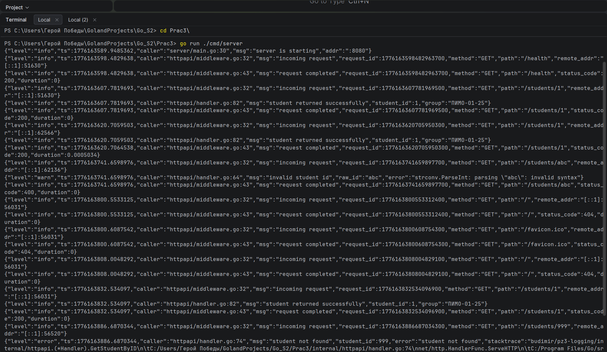
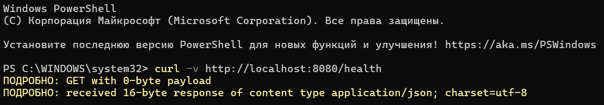
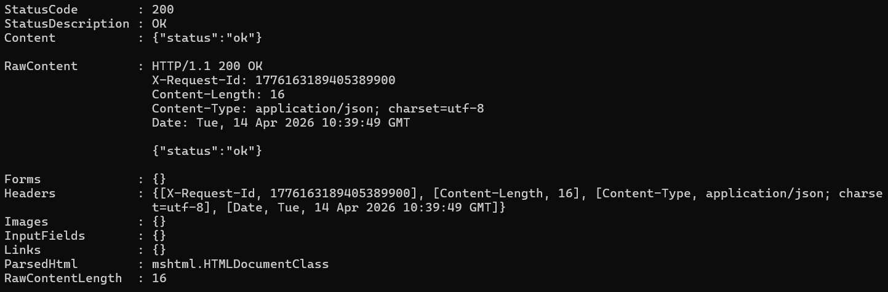
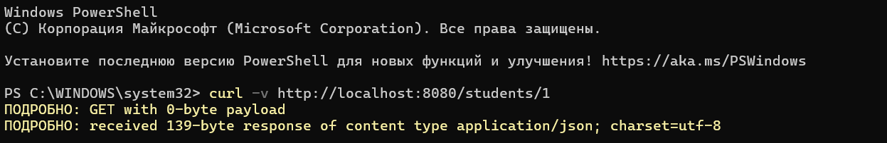
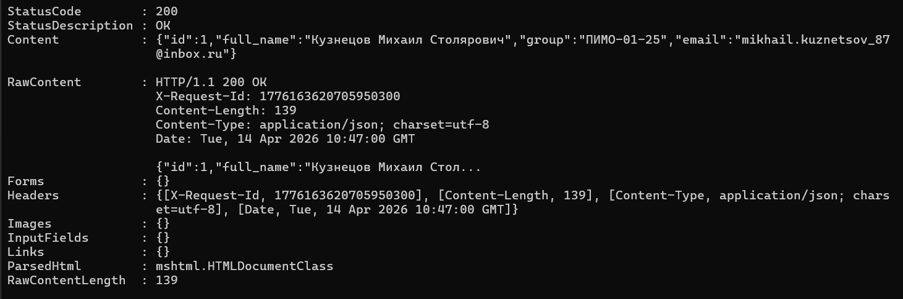
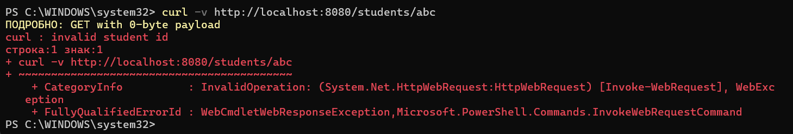
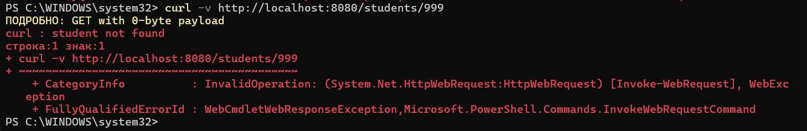
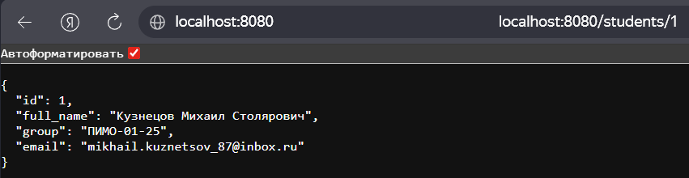

# Практическое занятие №3: Логирование с zap


**ФИО: Пряшников Дмитрий Максимович
Группа: ПИМО-01-25**

Структурированное логирование в backend-приложении на Go с использованием библиотеки `zap`.

## Цель работы

Освоить организацию структурированного логирования в Go-приложении: настройка `zap`, логирование HTTP‑запросов, добавление контекстных полей, уровни логирования.

## Выполненные задачи

- Создано HTTP‑приложение с двумя эндпоинтами: `/health` и `/students/{id}`.
- Настроен структурированный логгер `zap` с выводом в JSON в консоль.
- Реализован middleware для логирования входящих/исходящих запросов.
- Добавлены поля: `method`, `path`, `status_code`, `duration`, `request_id`.
- Логируются ошибки с дополнительным контекстом (`student_id`, `raw_id`).
- **Дополнительное задание (вариант 2)**: в ответ добавлен заголовок `X-Request-Id`, который генерируется для каждого запроса и фиксируется в логах.

## Структура проекта

```markdown
Prac3/
├── cmd/server/main.go
├── internal/
│ ├── httpapi/
│ │ ├── handler.go
│ │ ├── middleware.go
│ │ └── response_writer.go
│ └── student/
│ ├── model.go
│ └── repo.go
├── pkg/logger/logger.go
├── go.mod
└── README.md
```


# Запуск

```bash
go run ./cmd/server
```


## Health check
```bash
curl -v http://localhost:8080/health
```



## Получить студента с ID=1
```bash
curl -v http://localhost:8080/students/1
```



## Неверный ID
```bash
curl -v http://localhost:8080/students/abc
```


## Несуществующий ID
```bash
curl -v http://localhost:8080/students/999
```


## Доп задание
### Вариант 2 Добавить поле request_id в ответ
Передавайте идентификатор запроса не только в лог, но и в HTTP-заголовок ответа.
```bash
StatusCode        : 200
StatusDescription : OK
Content           : {"id":1,"full_name":"Кузнецов Михаил Столярович","group":"ПИМО-01-25","email":"mikhail.kuznetsov_87@inbox.ru"}

RawContent        : HTTP/1.1 200 OK
                    X-Request-Id: 1775026853341407701
                    Content-Length: 142
                    Content-Type: application/json; charset=utf-8
                    Date: Thu, 09 Apr 2026 23:08:47 GMT

                    {"id":1,"full_name":"Кузнецов Михаил Столярович","group":"ПИМО-01-25","email":"mikhail.kuznetsov_87@inbox.ru"}
Forms             : {}
Headers           : {[X-Request-Id, 1775026853341407701], [Content-Length, 142], [Content-Type, application/json; charset=utf-8], [Date, Thu, 09 Apr 2026 23:08:47 GMT]}
Images            : {}
InputFields       : {}
Links             : {}
ParsedHtml        : mshtml.HTMLDocumentClass
RawContentLength  : 142

```


# Вопросы и ответы по логированию в backend-приложениях

### 1. Зачем backend-приложению нужно логирование?

Логирование — это фундаментальный инструмент обеспечения наблюдаемости (observability) серверного приложения. Оно выполняет следующие ключевые задачи:

- **Фиксация жизненного цикла системы** — запуск, остановка, инициализация модулей, применение миграций и т.д.
- **Диагностика инцидентов** — позволяет разработчикам и администраторам находить причины сбоев как в реальном времени, так и постфактум.
- **Мониторинг производительности** — отслеживание времени обработки запросов, частоты вызовов эндпоинтов, нагрузки на БД.
- **Аудит и безопасность** — запись критических действий (удаление данных, изменение прав доступа) для последующего анализа.
- **Замена отладчика в production** — в рабочей среде невозможно поставить breakpoint, поэтому логи становятся главным источником информации.

Без логирования сопровождение сложного backend-приложения превращается в «гадание на кофейной гуще», так как отсутствуют объективные данные для анализа проблем.

---

### 2. Чем обычный текстовый лог отличается от структурированного?

**Обычный текстовый лог** — это последовательность строк в свободном формате, например:  
`"2026-04-09 23:08:47 user 15 requested /orders at 10:31"`

| Характеристика | Обычный текстовый лог | Структурированный лог |
|----------------|----------------------|----------------------|
| Формат | Произвольный текст | Ключ-значение (чаще JSON) |
| Читаемость человеком | Высокая | Средняя (в сыром виде) |
| Автоматический парсинг | Сложный (нужны regexp) | Простой (стандартные парсеры) |
| Поиск по полям | Трудоёмкий | Мгновенный (индексируется) |
| Фильтрация | Только по всей строке | По любому полю |
| Пример | `"user 15 requested /orders"` | `{"user_id":15,"path":"/orders"}` |

**Структурированный лог** — каждая запись представляет собой набор полей «ключ-значение», чаще всего в формате JSON:  
`{"timestamp":"2026-04-09T23:08:47Z","level":"info","user_id":15,"path":"/orders","msg":"request completed"}`

---

### 3. Что означает structured logging?

**Structured logging** (структурированное логирование) — это методология, при которой каждое событие логируется не как произвольная строка, а как структурированный набор данных (обычно ключ-значение).

Вместо одной фразы событие описывается набором полей:

| Поле | Назначение | Пример |
|------|-----------|--------|
| **message** | Что произошло | "student retrieved" |
| **level** | Важность события | "info", "error" |
| **timestamp** | Время события | "2026-04-09T23:08:47Z" |
| **context** | Контекстные атрибуты | `user_id`, `request_id`, `duration_ms` |

Этот подход превращает логи из «текста для чтения человеком» в **машиночитаемые данные**, которые можно:
- автоматически парсить и индексировать
- фильтровать и агрегировать без сложных regexp
- использовать для построения дашбордов и алертов
- связывать между собой (например, по `request_id`)

---

### 4. Какие уровни логирования используются в этой работе?

В работе применяются стандартные уровни severity из библиотеки **zap** (аналогичны другим логгерам):

| Уровень | Назначение | Пример в работе |
|---------|------------|----------------|
| **Debug** | Детальная отладочная информация, не нужная в production | "health endpoint called", "parsed request body" |
| **Info** | Нормальные рабочие события (успешные операции) | "server started on :8080", "student retrieved successfully" |
| **Warn** | Нештатные, но не критичные ситуации (приложение продолжает работу) | "invalid HTTP method", "malformed ID parameter" |
| **Error** | Ошибки, нарушающие выполнение текущей операции | "student not found", "failed to parse JSON" |

Дополнительно могут использоваться **Fatal** (критическая ошибка → аварийное завершение) и **DPanic** (паника в development-среде). Уровни позволяют управлять объёмом логов и быстро переключать детализацию в зависимости от окружения (dev/prod).

---

### 5. Почему полезно логировать HTTP-метод, путь и статус ответа?

Логирование этих трёх полей даёт минимальный, но достаточный контекст для анализа каждого запроса:

- **Метод + путь** → идентифицируют конкретную операцию: `GET /students/1`, `DELETE /students/5`
- **Статус ответа** → показывает результат: успех (2xx), клиентская ошибка (4xx), серверная ошибка (5xx)

**Практическая польза:**

| Возможность | Описание |
|-------------|----------|
| Определение популярных эндпоинтов | Оптимизация и масштабирование |
| Быстрое выявление ошибок | 500 → проблема сервера, 400 → проблема клиента |
| Сопоставление запрос-ответ | В сочетании с `request_id` |
| Построение метрик | Процент ошибок на маршрут, частота вызовов |
| Анализ трендов | Рост нагрузки на конкретный эндпоинт |

Без этих полей лог запроса выглядит как «что-то произошло» — совершенно бесполезно.

---

### 6. Зачем в лог добавляют время выполнения запроса?

**Время выполнения (duration)** — одна из важнейших метрик производительности. Она позволяет:

| Задача | Как помогает |
|--------|--------------|
| **Выявление медленных эндпоинтов** | `GET /reports` — 2 секунды вместо 200 мс |
| **Отслеживание деградации после релизов** | Рост времени выполнения на 30% → повод бить тревогу |
| **Установка SLO** | «95% запросов должны выполняться быстрее 100 мс» |
| **Диагностика проблем** | Долгое выполнение → проблемы с БД, API, блокировками |
| **Построение графиков** | duration в машиночитаемом формате (`0.123s`) легко агрегируется |

В комбинации с полями `method` и `path` можно получить точную картину: какой эндпоинт и при каких условиях тормозит.

---

### 7. Почему логирование ошибок должно содержать дополнительный контекст?

Одна строка `"error: student not found"` — это шум, а не информация. Без контекста она бесполезна для диагностики.

**Что даёт дополнительный контекст:**

| Поле | Что даёт |
|------|----------|
| `student_id=42` | Какого именно студента не нашли |
| `request_id=abc-123` | Поиск всех логов этого запроса |
| `path=GET /students/42` | Какой обработчик сработал |
| `user_id=15` | К какому пользователю относится ошибка |
| `source=db_query` | Где именно возникла ошибка |

**Почему это критично:**
- Ускоряет исправление багов — разработчик сразу видит все детали
- Позволяет анализировать паттерны ошибок
- Обеспечивает связность в распределённых системах через `trace_id`

Контекст превращает сырое сообщение об ошибке в **полноценную улику** для расследования инцидента.

---

### 8. В чём практическое преимущество zap?

**Zap** от Uber — это высокопроизводительный структурированный логгер для Go. Его ключевые преимущества:

| Характеристика | Преимущество zap |
|----------------|------------------|
| **Производительность** | Минимальное выделение памяти в куче, быстрее `logrus` в 5–10 раз |
| **Два API** | `Logger` (макс. скорость) и `SugaredLogger` (удобство) |
| **Типизированные поля** | `zap.Int64("id", 42)` — ошибки типов на этапе компиляции |
| **Конфигурируемость** | Лёгкое переключение между JSON и консольным форматом |
| **Промышленный стандарт** | Используется в Uber, Docker, Kubernetes, отличная документация |

**Сравнение с альтернативами:**

| Логгер | Статус | Производительность | Структурированный |
|--------|--------|-------------------|-------------------|
| `log` (стандартный) | Активный | Средняя | Нет (только текст) |
| `logrus` | Maintenance mode | Средняя | Да (но медленнее) |
| `zap` | Активный | Высокая | Да (оптимизирован) |
| `slog` (Go 1.21+) | Активный | Высокая | Да (встроенный) |

---

### 9. Что означает maintenance mode у logrus?

**Maintenance mode** (режим поддержки) — это официально объявленное состояние библиотеки, когда:

| Что происходит | Что НЕ происходит |
|---------------|------------------|
| Исправляются критические ошибки | Не добавляются новые функции |
| Патчи безопасности | Не принимаются функциональные пулл-реквесты |
| Поддержка существующей кодовой базы | Нет активной разработки новых возможностей |

Разработчики `logrus` объявили об этом в официальном репозитории на GitHub. Это означает:

✅ `logrus` остаётся стабильным и безопасным для **существующих проектов**  
❌ Для **новых проектов** рекомендуется выбирать альтернативы:

- `zap` (от Uber) — если нужна максимальная производительность
- `slog` (встроенный в Go 1.21+) — если хочется минимум внешних зависимостей

Maintenance mode — не «смерть» библиотеки, а сигнал сообществу, что её развитие завершено, и пора смотреть в сторону более современных решений.

---

### 10. Почему structured logging особенно важен для микросервисов и backend API?

В микросервисной архитектуре и высоконагруженных backend-системах structured logging становится не просто полезным, а **критически необходимым**:

| Проблема | Как решает structured logging |
|----------|-------------------------------|
| **Множество независимых сервисов** | Логи разбросаны по разным контейнерам → легко агрегируются в центральную систему (ELK, Loki) |
| **Огромный объём** (миллионы запросов/день) | Автоматическая фильтрация по полям (`service="auth" AND status>=500`) без ручного грепа |
| **Распределённая трассировка** | Поля `trace_id`, `span_id` позволяют восстановить цепочку вызовов между сервисами |
| **Быстрая диагностика инцидентов** | Запрос `status>=400 AND duration>1s AND service="payment"` → все подозрительные события |
| **Автоматическое извлечение метрик** | Системы мониторинга парсят логи и строят дашборды (P95 latency, топ ошибок) |
| **Алертинг по условиям** | «Если >10% запросов к `/checkout` вернули 500 за 5 минут → уведомление в Slack» |
