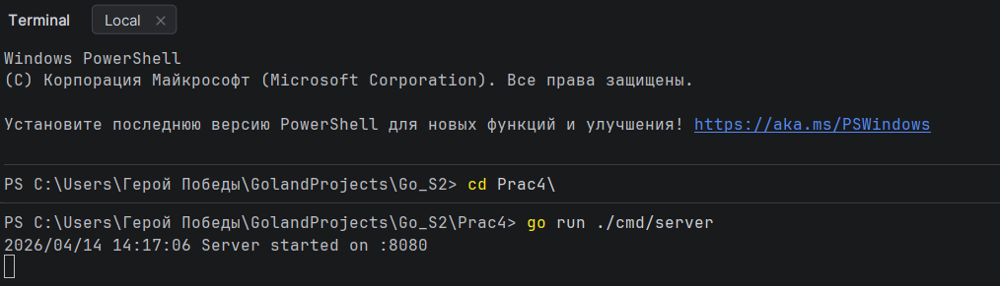
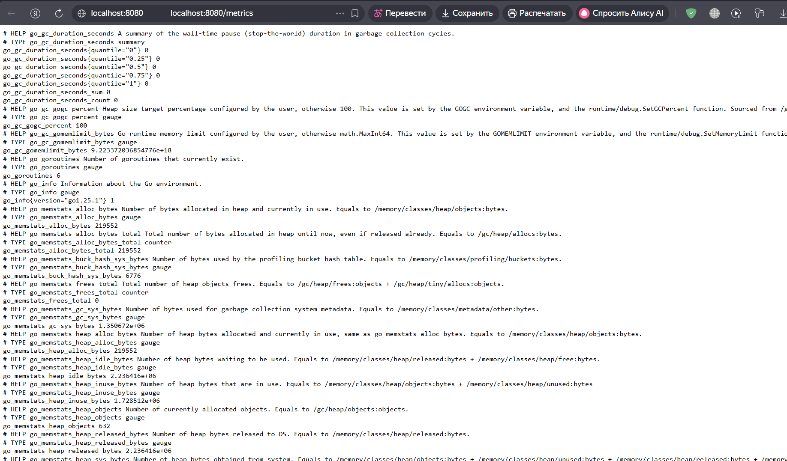
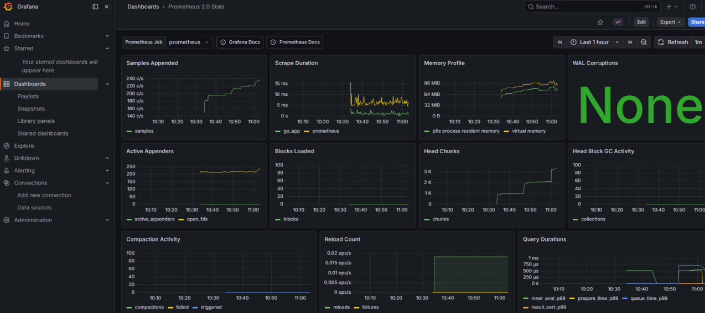

# Практическое занятие №4: Мониторинг с Prometheus и Grafana


**ФИО: Пряшников Дмитрий Максимович
Группа: ПИМО-01-25**

Настройка мониторинга Go-приложения с экспортом метрик в Prometheus и визуализацией в Grafana.

## Цель работы

Освоить базовую организацию мониторинга backend-приложения: экспорт метрик, сбор Prometheus, визуализация в Grafana.

## Выполненные задачи

- Создано HTTP-приложение на Go с эндпоинтами `/health`, `/students/{id}` и `/metrics`.
- Интегрирована клиентская библиотека Prometheus.
- Реализованы метрики:
    - `app_http_requests_total` — счётчик всех запросов (метод, путь).
    - `app_http_errors_total` — счётчик ошибок (метод, путь, статус).
    - `app_http_request_duration_seconds` — гистограмма времени обработки.
- **Дополнительное задание (вариант 2)**: добавлена отдельная гистограмма `app_student_request_duration_seconds` для маршрута `/students/{id}` с лейблом `student_id`.
- Настроен Prometheus для сбора метрик.
- Prometheus подключён как источник данных в Grafana.
- Создан базовый дашборд с графиками.

## Структура проекта
```markdown
Prac4/
├── cmd/server/main.go
├── internal/
│ ├── httpapi/
│ │ ├── handler.go
│ │ ├── middleware.go
│ │ └── response_writer.go
│ ├── metrics/metrics.go
│ └── student/
│ ├── model.go
│ └── repo.go
├── monitoring/prometheus.yml
├── go.mod
└── README.md
```

## Запуск

### 1. Go-приложение
```bash
go run ./cmd/server
```

```bash
Проверка метрик: http://localhost:8080/metrics
```

### 2. Prometheus
```bash
prometheus --config.file=monitoring/prometheus.yml
```
**После запуска видим:**


### 3. Grafana
```bash
Интерфейс: http://localhost:3000 (логин admin/admin)
```
**После чего наблюдаем:**

### 🧪 Генерация нагрузки
```bash
for i in {1..20}; do curl http://localhost:8080/health; done
for i in {1..15}; do curl http://localhost:8080/students/1; done
for i in {1..5}; do curl http://localhost:8080/students/999; done
```
### 📈 Примеры PromQL
```markdown
Общее число запросов: sum(app_http_requests_total)

Ошибки: sum(app_http_errors_total)

Средняя длительность за последнюю минуту:

text
sum(rate(app_http_request_duration_seconds_sum[1m])) / sum(rate(app_http_request_duration_seconds_count[1m]))
Запросы по студентам: sum by (student_id) (app_student_request_duration_seconds_count)
```



### Дополнительное задание
```
В рамках дополнительного задания реализована отдельная гистограмма `app_student_request_duration_seconds`. Её особенность заключается в том, что она фиксирует время обработки **только тех запросов**, чей путь начинается с префикса `/students/`.

При этом в лейбл (метку) `student_id` записывается числовой идентификатор, извлечённый из URL-адреса запроса (например, для пути `/students/42` в метку попадёт значение `42`).

Благодаря такому подходу становится возможным:
- Анализировать производительность обработки запросов в разрезе каждого отдельного студента.
- Выявлять, есть ли конкретные студенты, чьи данные обрабатываются медленнее остальных.
- Отслеживать динамику времени ответа для конкретного `student_id` во времени.
- Строить в Grafana графики и перцентили (P50, P95, P99) для запросов, связанных с конкретным студентом, что помогает точечно диагностировать проблемы.
```


# Контрольные вопросы по мониторингу приложений

## 1. Что такое метрики приложения?

**Метрики** — это количественные показатели, которые характеризуют состояние и поведение приложения в динамике. Они позволяют наблюдать за системой на宏观-уровне, выявлять тренды, аномалии и общие закономерности.

### Основные характеристики метрик:

| Характеристика | Описание |
|----------------|----------|
| **Тип данных** | Только числовые значения |
| **Привязка ко времени** | Каждое значение привязано к моменту или интервалу времени |
| **Агрегируемость** | Легко суммируются, усредняются, вычисляются перцентили |
| **Автоматизация** | Собираются автоматически без участия человека |

### Примеры метрик для backend‑приложения:

| Категория | Примеры метрик |
|-----------|----------------|
| **Нагрузка** | Количество HTTP‑запросов в секунду, количество активных соединений |
| **Ошибки** | Число ошибок 4xx/5xx, процент неудачных операций |
| **Производительность** | Длительность обработки запросов (P50, P95, P99) |
| **Ресурсы** | Использование памяти, CPU, количество горутин, GC-паузы |

Метрики собираются автоматически и агрегируются, что даёт возможность оценить общее состояние сервиса без необходимости анализировать каждый отдельный лог.

---

## 2. Чем метрики отличаются от логов?

Логи и метрики — это два взаимодополняющих инструмента наблюдаемости. Их ключевые отличия:

| Критерий | Логи | Метрики |
|----------|------|---------|
| **Основной вопрос** | «Что именно произошло?» (конкретное событие) | «Как система ведёт себя в целом?» (тенденции, агрегаты) |
| **Содержимое** | Текстовые сообщения и структурированные поля | Только числовые значения с метками (лейблами) |
| **Уникальность** | Каждая запись уникальна — это единичное событие | Хранятся как временные ряды (значение за интервал) |
| **Объём** | Может быть очень большим (GB/день) | Относительно компактный |
| **Применение** | Детальная отладка, расследование инцидентов | Мониторинг, алертинг, долгосрочный анализ |
| **Хранение** | Часто с ротацией (30-90 дней) | Дольше (месяцы/годы, с агрегацией) |

### Как они дополняют друг друга:

```
Метрики: "За последние 5 минут 15% запросов вернули 500-ю ошибку"
↓
Логи:   "Конкретный запрос /api/user/123 вернул 500, причина: таймаут БД"
↓
Решение: Поняли проблему и исправили
```

Логи помогают разобраться в отдельной проблеме, а метрики позволяют вовремя заметить, что проблема возникла и насколько она серьезна.

---

## 3. Какую роль выполняет Prometheus?

**Prometheus** — это система мониторинга с открытым исходным кодом, которая выполняет следующие функции:

| Функция | Описание |
|---------|----------|
| **Сбор метрик (Scraping)** | Регулярно опрашивает HTTP‑эндпоинты приложений и забирает метрики |
| **Хранение** | Сохраняет метрики как временные ряды в собственной встроенной БД (TSDB) |
| **Анализ** | Предоставляет мощный язык запросов **PromQL** для фильтрации, агрегации и анализа данных |
| **Алертинг** | Генерирует алерты на основе пороговых значений (через Alertmanager) |
| **Интеграция** | Может быть источником данных для Grafana, Kubernetes, других систем |

### Ключевая архитектурная особенность:

В отличие от многих других систем (где приложение само "пушит" метрики), в экосистеме Prometheus используется **pull-модель**:
- Приложение предоставляет метрики по HTTP (эндпоинт `/metrics`)
- Prometheus сам приходит за ними с заданным интервалом

Это упрощает обнаружение целей (service discovery) и позволяет Prometheus контролировать частоту сбора.

---

## 4. Что такое scraping в Prometheus?

**Scraping** (сбор / "выкачивание") — это процесс, при котором Prometheus периодически:

1. Выполняет HTTP‑запрос к указанным в конфигурации целям (targets)
2. Обращается к эндпоинту `/metrics`
3. Забирает и парсит метрики в формате exposition
4. Сохраняет полученные данные как временные ряды

### Параметры scraping:

| Параметр | Описание | Пример |
|----------|----------|--------|
| **Интервал сбора (scrape_interval)** | Как часто опрашивать цель | `15s`, `30s`, `1m` |
| **Таймаут (scrape_timeout)** | Максимальное время ожидания ответа | `10s` |
| **Метки (labels)** | Добавляемые метки ко всем метрикам цели | `environment: "production"` |

### Пример конфигурации в `prometheus.yml`:

```yaml
scrape_configs:
  - job_name: 'my-app'
    scrape_interval: 15s
    scrape_timeout: 10s
    static_configs:
      - targets: ['localhost:8080', 'localhost:8081']
        labels:
          environment: 'production'
```

---

## 5. Зачем приложению маршрут /metrics?

Маршрут `/metrics` — это **точка экспозиции метрик** для Prometheus. Он предоставляет данные в текстовом формате, который понимает Prometheus (формат exposition).

### Почему это необходимо:

| Причина | Объяснение |
|---------|------------|
| **Стандартизация** | Prometheus ожидает метрики именно по этому пути (может быть изменено в конфиге, но `/metrics` — стандарт) |
| **Формат** | Простой, но строгий текстовый формат, который легко парсить |
| **Автообнаружение** | Многие инструменты (Kubernetes, Consul) по умолчанию ищут `/metrics` |

### Как добавить в Go‑приложении:

```go
import (
    "github.com/prometheus/client_golang/prometheus/promhttp"
)

// Всего одна строка для подключения
http.Handle("/metrics", promhttp.Handler())
```

Без этого эндпоинта Prometheus физически не сможет получить данные о состоянии приложения.

---

## 6. Что делает promhttp.Handler()?

`promhttp.Handler()` — это функция из библиотеки `prometheus/client_golang`, которая возвращает стандартный `http.Handler`.

### Что происходит при вызове:

```go
handler := promhttp.Handler()
// handler можно использовать как обычный http.Handler
http.Handle("/metrics", handler)
```

### Что делает этот Handler:

| Действие | Описание |
|----------|----------|
| **Сбор метрик** | Обращается к глобальному реестру (`prometheus.DefaultGatherer`) |
| **Форматирование** | Преобразует метрики в текстовый формат exposition Prometheus |
| **Отдача ответа** | Возвращает `Content-Type: text/plain; version=0.0.4` с телом, содержащим все метрики |

### Автоматически собираемые метрики:

`promhttp.Handler()` автоматически отдаёт:
- Все метрики, зарегистрированные через `promauto` или явно через `prometheus.MustRegister()`
- Метрики самого клиента (Go runtime, HTTP-статистику при использовании `promhttp.InstrumentHandler...`)

Это делает добавление мониторинга в Go‑приложение буквально делом нескольких строк кода.

---

## 7. Для чего нужна Grafana?

**Grafana** — это платформа для визуализации данных с открытым исходным кодом. Она не собирает метрики сама, а подключается к различным источникам данных и строит на их основе дашборды.

### Основные возможности:

| Возможность | Описание |
|-------------|----------|
| **Визуализация** | Графики, таблицы, тепловые карты, гистограммы, шкалы, статистики |
| **Источники данных** | Prometheus, Loki, Elasticsearch, InfluxDB, PostgreSQL, и 50+ других |
| **Дашборды** | Интерактивные панели с возможностью фильтрации и детализации |
| **Алертинг** | Встроенная система оповещений (через Slack, Email, Telegram) |
| **Аннотации** | Отметки событий (релизы, инциденты) прямо на графиках |

### Типичная связка:

```
Приложение → (/metrics) → Prometheus → (PromQL) → Grafana → (дашборд) → Инженер
```

### Пример использования:

Grafana делает наблюдаемость наглядной, позволяя за несколько секунд увидеть:
- Динамику нагрузки за последние сутки
- Пики ошибок на конкретных эндпоинтах
- Деградацию производительности после релиза
- Прогнозируемое время заполнения диска

---

## 8. Какие три основные метрики реализованы в этой работе?

В работе реализованы три базовые метрики, покрывающие основные аспекты мониторинга HTTP‑сервиса:

| Метрика | Тип | Назначение | Метки (labels) |
|---------|-----|------------|----------------|
| `app_http_requests_total` | Counter | Общее количество HTTP‑запросов | `method`, `path` |
| `app_http_errors_total` | Counter | Количество ответов с HTTP‑статусом ≥ 400 | `method`, `path`, `status_code` |
| `app_http_request_duration_seconds` | Histogram | Распределение времени обработки запросов | `method`, `path` |

### Детальное описание каждой метрики:

**1. `app_http_requests_total` (Counter)**
- Счётчик, который только увеличивается
- Позволяет вычислять rate (запросов в секунду) через `rate()`
- Разбивка по методам и путям позволяет понять, какие эндпоинты самые популярные

**2. `app_http_errors_total` (Counter)**
- Считает только неуспешные запросы (4xx, 5xx)
- Дополнительная метка `status_code` позволяет отделять клиентские ошибки (4xx) от серверных (5xx)
- Отношение `errors_total / requests_total` даёт процент ошибок

**3. `app_http_request_duration_seconds` (Histogram)**
- Измеряет время выполнения запросов в секундах
- Позволяет вычислять средние значения, перцентили (P50, P95, P99)
- Критична для выявления медленных эндпоинтов

---

## 9. Что показывает Histogram?

**Histogram (гистограмма)** — это тип метрики, который измеряет **распределение** значений. В отличие от простого счётчика (Counter) или датчика (Gauge), гистограмма собирает статистику по заранее заданным интервалам.

### Как работает Histogram:

```
Входящие значения: [0.05s, 0.12s, 0.08s, 0.45s, 0.23s, 1.2s]

Buckets (интервалы):
  - 0.1s: ███ 3 запроса
  - 0.5s: ██████ 5 запросов  
  - 1.0s: ██████ 5 запросов
  - +Inf: ███████ 6 запросов
```

### Что можно вычислить из Histogram:

| Показатель | Формула в PromQL | Что показывает |
|------------|------------------|----------------|
| **Количество наблюдений** | `count()` | Сколько всего запросов |
| **Сумма значений** | `sum()` | Общее время всех запросов |
| **Среднее значение** | `sum() / count()` | Среднее время ответа |
| **P50 (медиана)** | `histogram_quantile(0.5, ...)` | Половина запросов быстрее этого значения |
| **P95** | `histogram_quantile(0.95, ...)` | 95% запросов быстрее (SLA-метрика) |
| **P99** | `histogram_quantile(0.99, ...)` | Худшие 1% запросов |

### Почему это важно для производительности:

> *"Среднее время ответа 100 мс может скрывать, что 50% запросов выполняются за 10 мс, а 50% — за 190 мс."*

Histogram показывает реальное распределение, позволяя выявлять:
- Выбросы (очень медленные запросы)
- Деградацию производительности на конкретных перцентилях
- Эффективность оптимизаций

---

## 10. Почему мониторинг важен для сопровождения backend-приложений?

Мониторинг даёт **объективную картину работы системы** в реальном времени и в ретроспективе. Без него разработка и сопровождение становятся "слепыми".

### Что даёт мониторинг:

| Задача | Как помогает мониторинг |
|--------|-------------------------|
| **Обнаружение проблем** | Автоматические алерты при превышении порогов (ошибки, задержки) |
| **Анализ инцидентов** | Ретроспективный просмотр метрик до и после проблемы |
| **Планирование ресурсов (capacity planning)** | Тренды нагрузки → прогнозирование необходимости масштабирования |
| **Оценка изменений** | Сравнение метрик до/после релиза → выявление деградации |
| **SLA / SLO** | Измерение соблюдения договорённостей о качестве обслуживания |
| **Бюджетирование** | Оптимизация затрат на основе реального использования |

### Что происходит без мониторинга:

```markdown
❌ Нельзя вовремя заметить рост числа ошибок или увеличение времени ответа
❌ Сложно планировать ресурсы — не видно, как меняется нагрузка
❌ Трудно выявлять деградацию после обновлений
❌ Алертинг становится невозможным — система не может сама сообщить о проблеме
❌ Инциденты находят пользователи, а не система
```

### Три столпа наблюдаемости (Observability):

```
        ┌─────────────┐
        │   Метрики   │ ← "Как система себя чувствует?" (количественно)
        ├─────────────┤
        │    Логи     │ ← "Что именно произошло?" (событийно)
        ├─────────────┤
        │   Трейсы    │ ← "Где именно проблема?" (в цепочке вызовов)
        └─────────────┘
```

Мониторинг (метрики) вместе с логированием и трейсингом составляет **основу наблюдаемости**, которая позволяет поддерживать надёжность сервиса в условиях эксплуатации. Без них даже простая backend‑система быстро превращается в "чёрный ящик", а инциденты решаются методом "перезагрузи, возможно, поможет".
