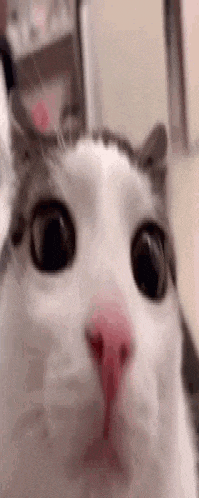
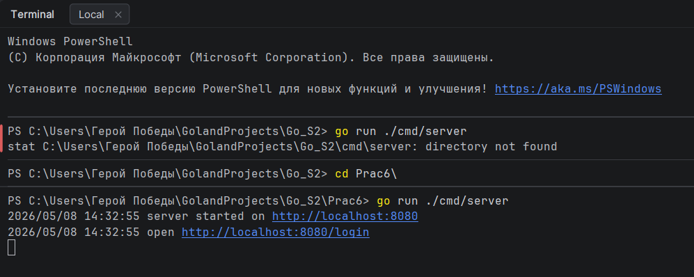
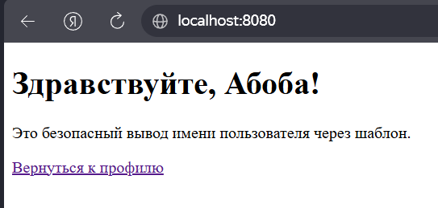
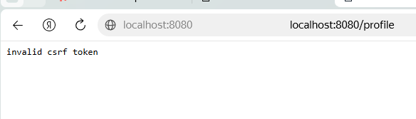
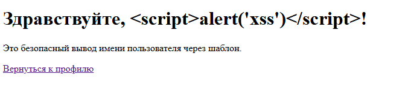

# Практическое занятие №6: Защита от CSRF/XSS и работа с secure cookies



**ФИО: Пряшников Дмитрий Максимович**  
**Группа: ПИМО-01-25**

Реализация CSRF-токенов, безопасных cookies и защита от XSS в Go-приложении.

---

## Цель работы

Освоить базовые практические подходы к защите web-приложения на Go от CSRF- и XSS-угроз, а также научиться безопасно использовать cookies для аутентификации и хранения пользовательского состояния.

---

## Выполненные задачи

- Реализовано mini-приложение с имитацией авторизованного пользователя.
- Установка **secure cookie** (HttpOnly, SameSite=Lax) при входе.
- Генерация и проверка **CSRF-токена** для защиты форм.
- Безопасный вывод пользовательских данных через шаблоны `html/template` (экранирование XSS).
- Демонстрация работы защиты:
  - успешное изменение имени при валидном CSRF-токене;
  - ошибка 403 при неверном или отсутствующем токене;
  - безопасное отображение тега `<script>` как обычного текста.
- **Дополнительное задание (вариант 1)** – добавлен маршрут `/logout` для очистки сессионной cookie.

---

## Структура проекта

```text
Prac6/
├── cmd/
│   └── server/
│       └── main.go                # точка входа, маршруты
├── internal/
│   ├── auth/
│   │   ├── cookie.go              # установка и чтение cookie
│   │   └── csrf.go                # генерация случайных токенов
│   ├── httpapi/
│   │   └── handler.go             # обработчики /login, /profile, /hello
│   └── store/
│       └── store.go               # in-memory хранилище профилей
├── templates/
│   ├── profile.html               # форма с CSRF-токеном
│   └── hello.html                 # страница приветствия
├── go.mod
└── README.md
```

---

## Запуск проекта

```bash
cd pz6-web-security
go run ./cmd/server
```

Сервер запускается на `http://localhost:8080`.  
Откройте в браузере: [http://localhost:8080/login](http://localhost:8080/login)

---

## Проверка сценариев

### 1. Вход и установка cookie

После перехода на `/login` сервер создаёт сессию, устанавливает cookie `session_id` и перенаправляет на `/profile`.



### 2. Редактирование профиля (успешный CSRF)

На странице `/profile` отображается форма со скрытым полем `csrf_token`. Введите новое имя и нажмите «Сохранить». Сервер проверяет токен и обновляет имя.



### 3. Ошибка при неверном CSRF-токене

Если отправить POST-запрос без токена или с неправильным значением, сервер возвращает `403 Forbidden`.



### 4. Защита от XSS

Попробуйте ввести в поле имени:  
`<script>alert('xss')</script>`

На странице `/hello` этот текст отображается как обычная строка – скрипт НЕ выполняется.



---

## (Вариант 1) – Logout

Добавлен маршрут `GET /logout`. Он удаляет сессионную cookie и завершает сессию пользователя.

**Реализация в `handler.go`:**

```go
func (h *Handler) Logout(w http.ResponseWriter, r *http.Request) {
    http.SetCookie(w, &http.Cookie{
        Name:   auth.SessionCookieName,
        Value:  "",
        Path:   "/",
        MaxAge: -1, // удалить cookie
    })
    http.Redirect(w, r, "/login", http.StatusFound)
}
```

После выхода повторный доступ к `/profile` возвращает `401 Unauthorized`.

---

## Контрольные вопросы


### 1. Что такое CSRF?

**CSRF** (Cross‑Site Request Forgery) – атака, при которой злоумышленник заставляет браузер уже авторизованного пользователя отправить нежелательный запрос к целевому сайту. Браузер автоматически добавляет cookies, поэтому сервер считает запрос легитимным.

---

### 2. Почему наличие cookie не гарантирует, что запрос действительно инициировал пользователь?

Cookie автоматически прикладывается браузером к любому запросу на тот же домен. Наличие cookie доказывает только факт предыдущей авторизации, но не доказывает, что текущее действие совершено самим пользователем осознанно (а не подставлено злоумышленником через скрытую форму или скрипт).

---

### 3. Что такое XSS?

**XSS** (Cross‑Site Scripting) – внедрение вредоносного клиентского кода (обычно JavaScript) в веб‑страницу, которую затем просматривают другие пользователи. Возникает, когда приложение выводит пользовательские данные в HTML без экранирования.

---

### 4. Чем CSRF отличается от XSS?

| Критерий | CSRF | XSS |
|----------|------|-----|
| Суть | Подделка запроса от имени пользователя | Внедрение скрипта в страницу |
| Цель | Выполнить действие на сервере | Украсть данные, подменить интерфейс |
| Доверие | Сервер доверяет запросу из-за cookie | Браузер доверяет коду, пришедшему с сервера |

> CSRF атакует **доверие сервера к браузеру**, XSS – **доверие браузера к серверу**.

---

### 5. Для чего нужен CSRF-токен?

CSRF-токен – случайное значение, которое сервер передаёт клиенту (например, в скрытом поле формы). При отправке действия (POST) клиент обязан вернуть этот токен. Токен **не добавляется браузером автоматически**, поэтому злоумышленник не может его подделать. Это доказывает, что запрос действительно пришёл с оригинальной страницы сайта.

---

### 6. Что делает атрибут HttpOnly у cookie?

`HttpOnly` запрещает доступ к cookie из JavaScript (через `document.cookie`). Даже при XSS-уязвимости злоумышленник не сможет украсть сессионную cookie.

---

### 7. Для чего нужен атрибут Secure?

`Secure` заставляет браузер отправлять cookie **только по HTTPS**. Это предотвращает перехват cookie в открытых сетях и защищает от атак типа «перехват сессии».

---

### 8. Какую роль играет SameSite?

| Значение | Поведение |
|----------|-----------|
| `Strict` | Cookie не отправляется ни при каких межсайтовых запросах |
| `Lax` | Cookie отправляется только для GET-запросов и навигации верхнего уровня (ссылки) |
| `None` | Отправляется всегда (требуется `Secure`) |

**Роль:** ограничивает отправку cookie в межсайтовых запросах, что затрудняет CSRF-атаки.

---

### 9. Почему нельзя вставлять пользовательский ввод в HTML через конкатенацию строк?

Конкатенация позволяет злоумышленнику внедрить HTML-теги или JavaScript:

```go
// ОПАСНО!
html := "<h1>Привет, " + userInput + "</h1>"
```

Если `userInput = "<script>alert('XSS')</script>"`, получится исполняемый скрипт. Правильный подход – экранирование.

---

### 10. Почему шаблоны безопаснее ручной сборки HTML?

Шаблонизатор `html/template` в Go **автоматически экранирует** все подставляемые данные. Опасные символы заменяются на HTML-сущности (`<` → `&lt;`). Разработчику не нужно помнить о вызове функций экранирования – защита работает «из коробки».

---

## Типичные ошибки

| Ошибка | Причина | Решение |
|--------|---------|---------|
| `unauthorized` после `/login` | Cookie не установилась или не отправляется браузером | Проверить, что путь cookie – `/`, нет конфликта доменов |
| CSRF всегда выдаёт 403 | Токен не передан в форме или не совпадает с сохранённым | Убедиться, что в форме есть `name="csrf_token"` и сервер его читает |
| JavaScript-код выполняется на странице | Данные выводятся без экранирования (ручная сборка HTML) | Использовать `html/template`, а не конкатенацию строк |
| Cookie не устанавливается при `Secure: true` | Приложение запущено по HTTP, а cookie требует HTTPS | Для локальной разработки ставить `Secure: false` или настроить HTTPS |

