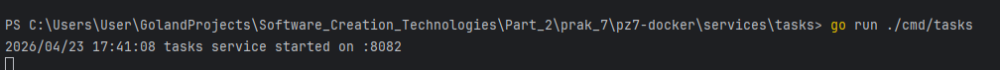
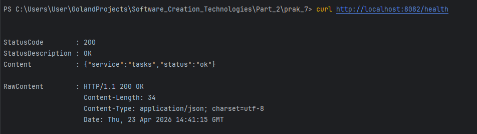
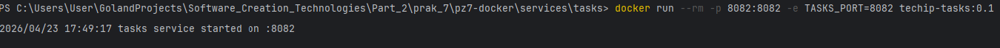
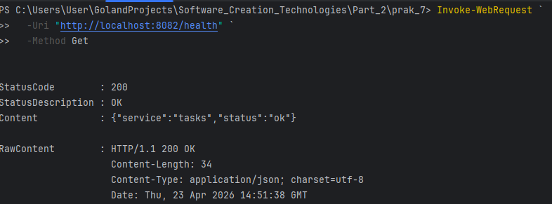

# Практическое занятие №7: Docker-контейнеризация Go-приложения


**ФИО: Пряшников Дмитрий Максимович**  
**Группа: ПИМО-01-25**

Контейнеризация backend-сервиса `tasks` с помощью Docker и Docker Compose.

---

## Цель работы

Освоить контейнеризацию backend-приложения на Go с помощью Docker, научиться писать Dockerfile, собирать Docker-образ и запускать контейнеризированный сервис в воспроизводимой среде.

---

## Выполненные задачи

- Создан учебный сервис `tasks` на Go с эндпоинтом `/health`.
- Написан **Dockerfile** с multi-stage сборкой (golang → alpine).
- Настроен `.dockerignore` для исключения лишних файлов из контекста сборки.
- Собран Docker-образ `techip-tasks:0.1`.
- Запущен контейнер с пробросом порта `8082:8082` и передачей переменной окружения `TASKS_PORT`.
- Проверена работа сервиса через `curl`.
- Написан `docker-compose.yml` для управления сервисом.
- Выполнен запуск через `docker compose up -d --build`.
- **Дополнительное задание** – добавлена поддержка чтения порта из переменной окружения в коде сервиса (уже реализовано).

---

## Структура проекта

```text
Prac7/
├── services/
│   └── tasks/
│       ├── cmd/
│       │   └── tasks/
│       │       └── main.go          # точка входа
│       ├── internal/                 # (опционально)
│       ├── go.mod
│       ├── go.sum
│       ├── Dockerfile
│       └── .dockerignore
├── deploy/
│   └── docker-compose.yml
└── README.md
```

---

## Требования

- **Go** 1.23+ (для локального запуска)
- **Docker Desktop** (для контейнеризации)

---

## Инструкция по запуску

### 1. Локальный запуск (без Docker)

```bash
cd services/tasks
go run ./cmd/tasks
```

Сервис запускается на порту `8082` (по умолчанию).



**Проверка:**

```bash
curl http://localhost:8082/health
```

Ожидаемый ответ:

```json
{"status":"ok","service":"tasks"}
```



---

### 2. Запуск в Docker (сборка образа и контейнер)

**Сборка образа:**

```bash
cd services/tasks
docker build -t techip-tasks:0.1 .
```

**Запуск контейнера:**

```bash
docker run --rm -p 8082:8082 -e TASKS_PORT=8082 techip-tasks:0.1
```



**Проверка:**

```bash
curl http://localhost:8082/health
```

Ответ должен быть таким же, как при локальном запуске.

---

### 3. Запуск через Docker Compose

```bash
cd deploy
docker compose up -d --build
```

Проверка состояния:

```bash
docker compose ps
```

Логи:

```bash
docker compose logs -f
```



Проверка работоспособности:

```bash
curl http://localhost:8082/health
```

Остановка:

```bash
docker compose down
```

---

## Дополнительное задание

**Поддержка порта через переменную окружения**

В коде `main.go` реализовано чтение переменной `TASKS_PORT` с значением по умолчанию `"8082"`:

```go
port := os.Getenv("TASKS_PORT")
if port == "" {
    port = "8082"
}
```

Это позволяет гибко менять порт при запуске контейнера без пересборки образа.

---

## Контрольные вопросы


### 1. Чем Docker-образ отличается от контейнера?

| Понятие | Описание |
|---------|----------|
| **Образ (image)** | Шаблон, содержащий приложение, зависимости и настройки. Неизменяемый. |
| **Контейнер (container)** | Запущенный экземпляр образа. Имеет своё состояние, процессы и сеть. |

> Образ – это «заготовка», контейнер – «работающий экземпляр».

---

### 2. Зачем нужен Dockerfile?

Dockerfile – это текстовый файл с инструкциями для сборки образа. В нём описывается:

- базовая ОС (`FROM`);
- копирование файлов (`COPY`);
- установка зависимостей (`RUN`);
- команда запуска (`CMD`).

Без Dockerfile невозможно автоматизировать создание образа.

---

### 3. Что такое multi-stage build?

Multi-stage build – техника, при которой в одном Dockerfile используется несколько стадий (блоков `FROM`). На первой стадии приложение компилируется, на финальной – копируется только готовый бинарник.

**Пример из работы:**

```dockerfile
FROM golang:1.23 AS builder   # стадия сборки
...
FROM alpine:3.20              # финальная стадия
COPY --from=builder /app/bin/tasks /app/tasks
```

---

### 4. Почему для Go-сервисов удобно использовать multi-stage build?

- Go компилируется в статический бинарник, который не требует рантайма Go.
- Финальный образ получается **маленьким** (Alpine + бинарник) – десятки МБ вместо сотен.
- В образе нет компилятора, лишних инструментов и исходного кода – безопаснее и быстрее загружается.

---

### 5. Зачем нужен .dockerignore?

`.dockerignore` исключает файлы и папки из **контекста сборки** (того, что отправляется Docker-демону при выполнении `docker build`). Это:

- ускоряет сборку (меньше данных передаётся);
- уменьшает размер образа;
- предотвращает попадание секретов, логов, системных файлов.

---

### 6. Для чего используются переменные окружения в контейнере?

Переменные окружения позволяют **конфигурировать приложение без изменения кода и пересборки образа**. Например:

- порт (`TASKS_PORT`);
- строка подключения к БД;
- уровень логирования;
- ключи API (секреты лучше через Docker secrets).

Передаются через `-e` при `docker run` или поле `environment` в `docker-compose.yml`.

---

### 7. Что делает флаг -p при запуске контейнера?

`-p <хост-порт>:<контейнер-порт>` – проброс порта. Направляет трафик с указанного порта хоста на указанный порт внутри контейнера.

Пример: `-p 8082:8082` – запросы к `localhost:8082` попадают в контейнер на порт `8082`.

---

### 8. Для чего нужен Docker Compose?

Docker Compose – инструмент для **запуска многоконтейнерных приложений** из одного YAML-файла. Позволяет:

- описывать все сервисы (бэкенд, БД, кэш, очереди);
- задавать зависимости между ними;
- запускать одной командой (`docker compose up`);
- управлять сетями, томами, переменными.

В работе используется для запуска одного сервиса, но легко расширяется.

---

### 9. Почему контейнеризация упрощает деплой?

Контейнер содержит **всё необходимое для работы** – приложение, зависимости, настройки ОС. Деплой сводится к:

1. Загрузке образа на сервер.
2. Запуску контейнера.

Не нужно настраивать Go, устанавливать пакеты, следить за версиями. Окружение одинаково на всех этапах (разработка, тестирование, production).

---

### 10. Почему не стоит вшивать конфигурацию и секреты прямо в образ?

- **Безопасность** – секреты (пароли, токены) попадут в образ и могут быть извлечены.
- **Гибкость** – при смене параметра (порт, URL БД) придётся пересобирать образ.
- **Универсальность** – один образ можно использовать в разных средах (dev, staging, prod) с разными переменными окружения.

---

## Типичные ошибки

| Ошибка | Причина | Решение |
|--------|---------|---------|
| `docker build` не находит файлы | Контекст сборки не тот (команда выполнена не в папке с Dockerfile) | Выполнять `docker build` из папки `services/tasks` или указать верный контекст |
| Сервис недоступен по `localhost:8082` | Приложение внутри контейнера слушает `127.0.0.1` вместо `0.0.0.0` | Исправить адрес в коде: `ListenAndServe(":"+port, ...)` – уже сделано |
| В образ попали большие или секретные файлы | Отсутствует `.dockerignore` | Создать `.dockerignore` с исключениями (`.git`, `*.log`, `.env` и т.д.) |
| Переменная окружения не применяется | Приложение читает не ту переменную или не использует `os.Getenv` | Проверить код, имя переменной и её передачу (`-e` или `environment`) |
| Контейнер сразу завершается (exit 0) | Команда запуска не является "долгоживущей" или приложение падает с ошибкой | Проверить `CMD` в Dockerfile, запустить `docker logs <container>` |
