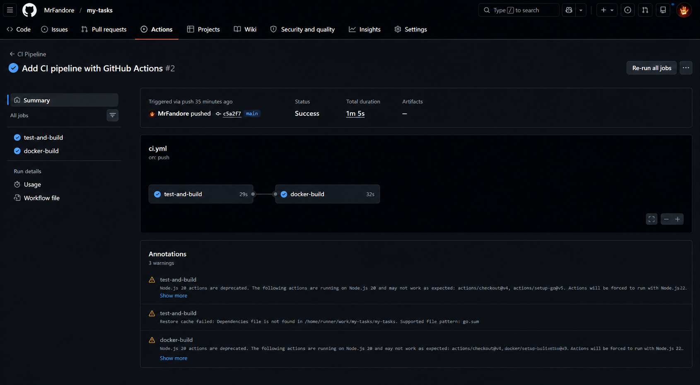

# Практическое занятие №8: CI/CD для Go-приложения (GitHub Actions)


**ФИО: Пряшников Д.М.**  
**Группа: ПИМО-01-25**

Настройка автоматического CI/CD pipeline для backend-проекта на Go: тесты, сборка, Docker-образ.

---

## Цель работы

Освоить основы CI/CD для backend-проекта на Go, научиться настраивать автоматический pipeline для проверки, сборки, упаковки Docker-образа и подготовки приложения к доставке.

---

## Выполненные задачи

- Создан репозиторий с Go-сервисом `tasks` (эндпоинт `/health`).
- Написан тест `main_test.go` для проверки работоспособности сервиса.
- Настроен **GitHub Actions pipeline** (файл `.github/workflows/ci.yml`).
- Pipeline включает:
  - установку Go 1.25.1;
  - загрузку зависимостей (`go mod tidy`);
  - запуск тестов (`go test ./...`);
  - сборку приложения (`go build ./...`);
  - сборку Docker-образа с тегом `techip-tasks:${{ github.sha }}`.
- Проверено успешное выполнение pipeline в GitHub (скриншот).
- **Дополнительное задание** – добавлена публикация Docker-образа в GitHub Container Registry (GHCR) с использованием секретов.

---

## Структура проекта

```text
Prac8-cicd/
├── assets/                           # скриншоты
├── deploy/
│   └── docker-compose.yml            # запуск через compose
├── services/
│   └── tasks/
│       ├── cmd/tasks/main.go         # точка входа
│       ├── main_test.go              # тесты
│       ├── go.mod / go.sum
│       ├── Dockerfile
│       └── .dockerignore
├── .github/workflows/
│   └── ci.yml                        # CI/CD pipeline
└── README.md
```

---

## Краткое объяснение CI и CD

| Термин | Расшифровка | Что делает в проекте |
|--------|-------------|----------------------|
| **CI** | Continuous Integration | При каждом push или PR запускает тесты и сборку, проверяя, что код не сломал проект. |
| **CD** | Continuous Delivery / Deployment | Автоматически собирает Docker-образ и (опционально) публикует его в registry. |

> В данной работе реализована **CI + CD (доставка)** – pipeline собирает образ, но деплой на сервер не автоматизирован (может быть добавлен).

---

## Полный YAML-файл pipeline (`.github/workflows/ci.yml`)

```yaml
name: CI Pipeline

on:
  push:
    branches: [ "main", "master" ]
  pull_request:
    branches: [ "main", "master" ]

jobs:
  test-and-build:
    runs-on: ubuntu-latest

    steps:
      - name: Checkout repository
        uses: actions/checkout@v4

      - name: Setup Go
        uses: actions/setup-go@v5
        with:
          go-version: '1.25.1'

      - name: Show Go version
        run: go version

      - name: Download dependencies
        run: go mod tidy
        working-directory: ./services/tasks

      - name: Run tests
        run: go test ./...
        working-directory: ./services/tasks

      - name: Build application
        run: go build ./...
        working-directory: ./services/tasks

  docker-build:
    runs-on: ubuntu-latest
    needs: test-and-build

    steps:
      - name: Checkout repository
        uses: actions/checkout@v4

      - name: Set up Docker Buildx
        uses: docker/setup-buildx-action@v3

      - name: Build Docker image
        run: docker build -t techip-tasks:${{ github.sha }} .
        working-directory: ./services/tasks
```

---

## Пояснение шагов pipeline

### Job `test-and-build`

| Шаг | Действие | Зачем |
|-----|----------|-------|
| `actions/checkout@v4` | Клонирует репозиторий | Без кода нечего проверять |
| `actions/setup-go@v5` | Устанавливает Go 1.25.1 | Фиксирует версию языка |
| `go version` | Выводит версию | Для диагностики |
| `go mod tidy` | Скачивает зависимости | Проверяет, что `go.mod` актуален |
| `go test ./...` | Запускает тесты | Основная CI-проверка |
| `go build ./...` | Компилирует код | Убеждается, что проект собирается |

### Job `docker-build`

| Шаг | Действие | Зачем |
|-----|----------|-------|
| `actions/checkout@v4` | Клонирует репозиторий | Нужен Dockerfile и исходники |
| `docker/setup-buildx-action@v3` | Настраивает Buildx | Для современных сборок |
| `docker build -t ...` | Собирает образ | Создаёт артефакт для доставки |

> `needs: test-and-build` означает, что `docker-build` запустится **только после успеха** тестов и сборки.

---

## Способ формирования тега образа

```yaml
docker build -t techip-tasks:${{ github.sha }} .
```

- `${{ github.sha }}` – полный 40-символьный хеш коммита.
- Пример тега: `techip-tasks:a1b2c3d4e5f6g7h8i9j0k1l2m3n4o5p6q7r8s9t`

**Альтернативы:**
- `github.run_number` – номер запуска (1,2,3…)
- `github.ref_name` – имя ветки или тега
- `YYYYMMDD-HHMMSS` – дата и время

---

## Где должны храниться секреты

**Секреты** – это чувствительные данные (пароли, токены, SSH-ключи), которые нельзя коммитить в репозиторий.

### Правильное место: **GitHub Secrets**

1. Перейдите в репозиторий → **Settings** → **Secrets and variables** → **Actions**.
2. Нажмите **New repository secret**.
3. Добавьте, например:
    - `REGISTRY_USERNAME` – имя пользователя для Docker registry
    - `REGISTRY_PASSWORD` – пароль или токен
    - `SSH_PRIVATE_KEY` – ключ для деплоя на VPS

### Использование в pipeline

```yaml
- name: Login to GHCR
  run: echo "${{ secrets.REGISTRY_PASSWORD }}" | docker login \
    -u "${{ secrets.REGISTRY_USERNAME }}" \
    --password-stdin ghcr.io
```

### Что нельзя делать

- Записывать секреты прямо в `.yml` (увидят все).
- Хранить в `.env` и коммитить.
- Передавать в логах (GitHub Actions автоматически скрывает секреты, но лучше не рисковать).

---

## Проверка работы pipeline

После push в `main` или `master` зайдите во вкладку **Actions** репозитория.



Ожидаемый результат: оба job (`test-and-build`, `docker-build`) зеленые.

---

## Локальный запуск (для проверки)

```bash
cd services/tasks
go run ./cmd/tasks
# в другом терминале:
curl http://localhost:8082/health
```

Сборка Docker-образа локально:

```bash
docker build -t techip-tasks:0.1 .
docker run --rm -p 8082:8082 -e TASKS_PORT=8082 techip-tasks:0.1
```

---

## Дополнительное задание (публикация образа в GHCR)

Добавлен шаг в `docker-build` для логина и пуша в GitHub Container Registry.

```yaml
- name: Login to GitHub Container Registry
  run: echo "${{ secrets.GHCR_PAT }}" | docker login ghcr.io -u ${{ github.actor }} --password-stdin

- name: Push image
  run: |
    docker tag techip-tasks:${{ github.sha }} ghcr.io/${{ github.repository_owner }}/techip-tasks:${{ github.sha }}
    docker push ghcr.io/${{ github.repository_owner }}/techip-tasks:${{ github.sha }}
```

Секрет `GHCR_PAT` – Personal Access Token с правами `write:packages`.

---

## Типичные ошибки

| Ошибка | Причина | Решение |
|--------|---------|---------|
| `go: go.mod file not found` | Неправильный `working-directory` | Указать путь до папки с `go.mod` |
| `Dockerfile not found` | Неверный контекст сборки | В `docker build` указать правильный путь или `working-directory` |
| Pipeline не запускается | Ветка не `main`/`master` или событие не `push`/`pull_request` | Проверить `on:` в YAML |
| `cannot find package` | Зависимости не подтянулись | Добавить `go mod download` или `go mod tidy` |
| Секрет не виден | Секрет создан, но имя не совпадает | Проверить `secrets.ИМЯ` в YAML |

---

## Контрольные вопросы


### 1. Чем CI отличается от CD?

| | CI (Continuous Integration) | CD (Continuous Delivery/Deployment) |
|--|-----------------------------|--------------------------------------|
| **Что делает** | Проверяет код при каждом изменении (тесты, сборка) | Готовит артефакт (Docker-образ) и/или разворачивает |
| **Когда запускается** | При push/PR | После успешной CI |
| **Цель** | Обнаружить ошибки как можно раньше | Доставить приложение в production-среду |

---

### 2. Почему pipeline должен запускать тесты?

Тесты – это **первая линия обороны**. Они автоматически проверяют, что новое изменение не сломало существующую функциональность. Без тестов CI бесполезна – можно собрать бинарник, но он может быть полностью сломан.

---

### 3. Зачем нужен автоматический build?

Автоматическая сборка гарантирует, что код **компилируется** в изолированной среде, а не только на машине разработчика. Это выявляет проблемы с зависимостями, версиями Go, отсутствующими файлами и т.д.

---

### 4. Почему важно собирать Docker-образ в CI, а не только локально?

- **Воспроизводимость** – образ собирается в чистом окружении (Ubuntu, Docker).
- **Тегирование** – каждый образ связан с конкретным коммитом.
- **Регистр** – готовый образ можно загрузить в registry и использовать на любом сервере.
- **Безопасность** – сборка выполняется в изолированной CI-среде, а не на рабочей машине разработчика.

---

### 5. Что такое CI secrets?

CI secrets – это зашифрованные переменные, которые хранятся в CI-системе (GitHub Actions, GitLab CI) и передаются в pipeline во время выполнения. Они предназначены для хранения паролей, токенов, SSH-ключей.

---

### 6. Почему нельзя хранить токены и SSH-ключи в репозитории?

- **Утечка** – любой, кто имеет доступ к репозиторию, увидит секреты.
- **История Git** – даже если удалить файл, он останется в истории коммитов.
- **Автоматические боты** – злоумышленники сканируют GitHub на предмет случайно закоммиченных секретов.

---

### 7. Для чего нужен тег Docker-образа?

Тег – это **идентификатор версии** образа. Он позволяет:
- отличать одну сборку от другой (`latest`, `0.1`, `a1b2c3d`);
- откатиться к предыдущей версии;
- понять, какой код соответствует запущенному контейнеру.

---

### 8. Что делает job docker-build?

Job `docker-build` (в данном pipeline) выполняет:
1. Клонирование репозитория.
2. Настройку Docker Buildx.
3. Сборку Docker-образа из Dockerfile.
4. (Опционально) публикацию образа в registry.

Он запускается **после** успешного `test-and-build`, чтобы не тратить время на сборку образа, если тесты провалились.

---

### 9. Почему в multi-service проекте важен working-directory?

В монорепозитории (несколько сервисов в одном репозитории) каждый сервис лежит в своей подпапке. `working-directory` указывает CI, в какой папке выполнять команды (`go mod tidy`, `docker build`). Без него CI будет пытаться запускать команды в корне, где нет `go.mod` или Dockerfile.

---

### 10. Какие риски возникают при полностью автоматическом деплое (Continuous Deployment)?

- **Автоматическое развертывание бага** – если тесты пропустили ошибку, она попадёт в production.
- **Зависимость от внешних сервисов** – сбой registry, SSH, сервера может остановить деплой.
- **Отсутствие ручной проверки** – иногда нужно убедиться в работоспособности перед выкаткой.
- **Сложность отката** – если автоматика деплоит новую версию, а потом обнаруживается проблема, откат тоже должен быть автоматизирован.

> Поэтому многие команды используют **Continuous Delivery** (образ готов, но деплой запускается вручную), а полный автоматический деплой применяют при высоком уровне тестирования и мониторинга.