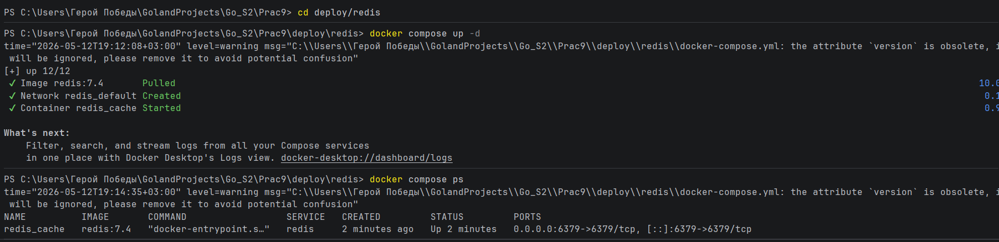
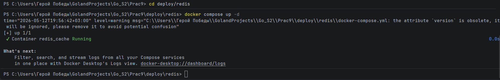
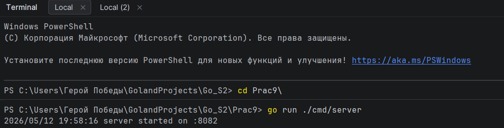
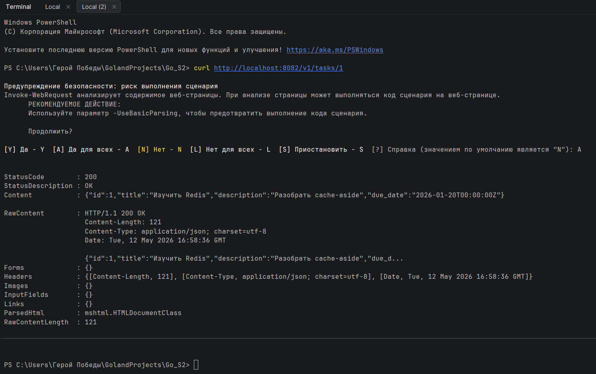
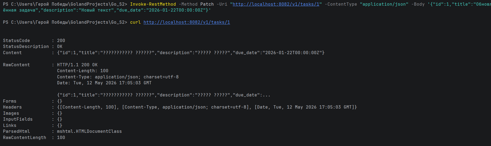
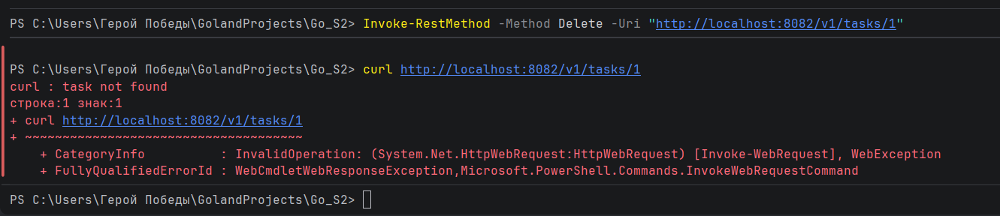
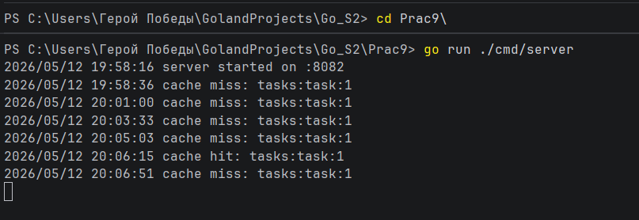
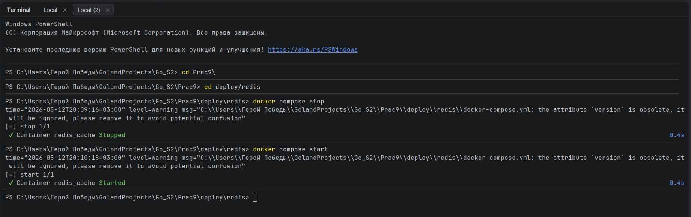

# Практическое занятие №9: Реализация распределённого кэша (Redis)

**ФИО: Пряшников Д.М.**  
**Группа: ПИМО-01-25**

Внедрение Redis в backend-приложение на Go: стратегия cache-aside, TTL с jitter, инвалидация и отказоустойчивость.

---

## Цель работы

Освоить внедрение распределённого кэша в backend-приложение на Go и реализовать стратегию cache-aside с использованием Redis, корректного TTL, jitter и устойчивого поведения сервиса при недоступности кэша.

---

## Cтруктура проекта

```text
Prac9/
├── cmd/
│   └── server/
│       └── main.go
├── internal/
│   ├── cache/
│   │   ├── redis.go        # подключение к Redis
│   │   ├── keys.go         # формирование ключей
│   │   └── ttl.go          # TTL с jitter
│   ├── config/
│   │   └── config.go       # конфигурация (адрес, таймауты, TTL)
│   ├── httpapi/
│   │   └── handler.go      # обработчики HTTP
│   ├── service/
│   │   └── task_service.go # бизнес-логика с cache-aside
│   └── task/
│       ├── model.go        # структура Task
│       └── repo.go         # in-memory репозиторий
├── deploy/
│   └── redis/
│       └── docker-compose.yml
└── go.mod
```

---

## Запуск стенда

### 1. Запуск Redis

```bash
cd deploy/redis
docker compose up -d
docker compose ps
```




### 2. Запуск Go-сервиса

```bash
go run ./cmd/server
```



Сервер слушает `http://localhost:8082`.

---

## 🧪 Проверка работы кэша

### Первый запрос (cache miss)

```bash
curl http://localhost:8082/v1/tasks/1
```

Данных в Redis нет → запрос идёт в репозиторий → результат возвращается и сохраняется в кэше.

### Второй запрос (cache hit)

```bash
curl http://localhost:8082/v1/tasks/1
```

Данные возвращаются из Redis. В логах сервиса появятся сообщения `cache miss` и `cache hit`.




---

## Проверка инвалидации кэша

### Обновление задачи (PATCH)

```bash
curl -X PATCH http://localhost:8082/v1/tasks/1 \
  -H "Content-Type: application/json" \
  -d '{"id":1,"title":"Обновлённая задача","description":"Новый текст","due_date":"2026-01-22T00:00:00Z"}'
```

После обновления ключ `tasks:task:1` удаляется из Redis. Следующий `GET` снова вызовет cache miss и загрузит свежие данные.

### Удаление задачи (DELETE)

```bash
curl -X DELETE http://localhost:8082/v1/tasks/1
curl http://localhost:8082/v1/tasks/1   # → 404 Not Found
```

Ключ также удаляется из кэша.

---

## ⚠️ Проверка отказоустойчивости

Остановите Redis:

```bash
cd deploy/redis
docker compose stop
```



Теперь выполните запрос:

```bash
curl http://localhost:8082/v1/tasks/2
```

Сервис:
- не падает,
- не зависает,
- выдаёт данные из репозитория,
- логирует ошибку подключения к Redis.




---

## Дополнительные задания

### Вариант 1 – Кэширование списка задач
Добавлен эндпоинт `GET /v1/tasks` с ключом `tasks:list`. После модификации любой задачи список инвалидируется.

### Вариант 2 – Отдельное логирование hit/miss
В сервисный слой добавлены чёткие сообщения:
- `cache miss: tasks:task:1`
- `cache hit: tasks:task:1`
- `cache set: tasks:task:1`
- `cache invalidated: tasks:task:1`

### Вариант 3 – Разделение key-builder и serializer
Вынесены отдельные функции `TaskByIDKey(id)` и `MarshalTask/UnmarshalTask`.

---

## Контрольные вопросы

### 1. Что такое cache-aside?

**Cache-aside** – стратегия, при которой приложение само управляет кэшем. Алгоритм:
1. Попытаться прочитать данные из кэша.
2. Если данные есть (`hit`) – вернуть их.
3. Если данных нет (`miss`) – прочитать из основного хранилища (БД).
4. Сохранить прочитанные данные в кэш (с TTL).
5. Вернуть ответ клиенту.

При обновлении/удалении данных приложение само удаляет соответствующие ключи из кэша.

---

### 2. Почему Redis не должен быть источником истины?

Redis – это **in-memory кэш**, который может потерять данные при перезапуске, переполнении или сбое. Данные в Redis могут быть устаревшими (если TTL ещё не истёк, а БД уже изменилась). Источником истины всегда остаётся **основное хранилище** (БД). Redis нужен только для ускорения повторных чтений.

---

### 3. Зачем нужен TTL?

**TTL (Time To Live)** – время жизни ключа в кэше. После истечения TTL ключ автоматически удаляется. Это необходимо для:
- **самообновления** данных (кэш не хранит устаревшие данные бесконечно);
- **контроля размера** кэша (старые ключи удаляются);
- **снижения нагрузки** на ручную инвалидацию.

---

### 4. Что такое jitter?

**Jitter** – случайный разброс, добавляемый к базовому TTL. Если всем ключам назначить одинаковый TTL, они могут истечь одновременно, что вызовет резкий всплеск запросов к БД. Jitter «размазывает» моменты истечения, делая нагрузку на БД более равномерной.

Пример:  
базовый TTL = 120 с, jitter = 30 с → реальный TTL будет от 120 до 150 секунд.

---

### 5. Почему одинаковый TTL для всех ключей может быть проблемой?

Если тысячи ключей истекают в одну секунду, приложение получит лавину `cache miss` и одновременно кинется в БД. Это может вызвать:
- высокую нагрузку на БД;
- рост задержек;
- временную деградацию или отказ.

Jitter позволяет распределить истечение ключей во времени, сглаживая пики.

---

### 6. Как должен вести себя сервис при недоступности Redis?

Сервис **не должен падать** и **не должен зависать**. Требования:
- Логировать ошибку подключения/таймаута.
- Продолжать работать **напрямую с БД** (основным хранилищем).
- Не блокировать запросы дольше установленных таймаутов.
- При восстановлении Redis – снова начать использовать кэш (без перезапуска).

В данной реализации таймауты на чтение/запись Redis установлены в 2 секунды, а ошибки Redis не прерывают выполнение запроса.

---

### 7. Почему кэш нужно инвалидировать после изменения данных?

Если данные в БД изменились (через `PATCH` или `DELETE`), а в Redis осталось старое значение, клиент получит **устаревшие данные**. Это называется **кэш-неконсистентность**. Чтобы этого избежать, нужно после каждой операции записи/удаления удалять (инвалидировать) соответствующий ключ в Redis. Следующий запрос прочитает свежие данные из БД и снова заполнит кэш.

---

### 8. Чем кэширование одной сущности проще, чем кэширование списка?

| Характеристика | Одна сущность (task by id) | Список (tasks list) |
|----------------|----------------------------|----------------------|
| **Ключ** | Фиксированный шаблон `tasks:task:{id}` | Может зависеть от параметров (пагинация, фильтры) |
| **Инвалидация** | При изменении удаляется один ключ | При любом изменении любой задачи нужно удалить **все** варианты списков (или пересоздавать их) |
| **Сложность** | Низкая | Высокая (часто проще вообще не кэшировать список) |

Поэтому в учебной работе сначала реализуют кэширование по идентификатору – это базовая, понятная практика.

---

### 9. В чём смысл ключа вида `tasks:task:<id>`?

Ключ имеет **семантическую структуру**:
- `tasks` – domain/тип данных,
- `task` – сущность,
- `<id>` – конкретный идентификатор.

Преимущества:
- легко понять, что за данные хранятся;
- можно удалять все ключи по префиксу (например, `tasks:task:*`);
- предсказуемость – по ID можно сразу вычислить ключ.

---

### 10. Почему Redis рассматривается как внешняя инфраструктурная зависимость?

Redis работает в **отдельном контейнере/процессе**, доступен по сети, имеет свои настройки, может быть перезапущен или отказать. Приложение не должно полагаться на него как на «встроенную память». Отношение к Redis как к внешней зависимости требует:
- настройки таймаутов,
- обработки ошибок,
- graceful degradation.

Это приближает учебный проект к реальной production-архитектуре.

---

## Типичные ошибки

| Ошибка | Проявление | Решение |
|--------|------------|---------|
| **Сервис падает при недоступности Redis** | `panic` или `Fatal` при ошибке подключения | Не выходить из программы, логировать и идти в БД |
| **Нет TTL** | Ключи копятся бесконечно, память Redis переполняется | Всегда устанавливать `SetEX` или `Set` с `ttl` |
| **Нет jitter** | Одновременное истечение тысяч ключей → пик нагрузки на БД | Добавить случайную добавку к TTL |
| **Ключи формируются хаотично** | Например, `task_1`, `task1`, `task/1` | Использовать единый формат: `domain:entity:id` |
| **После PATCH/DELETE кэш не сбрасывается** | Клиент получает старые данные после обновления | Вызывать `Del` по ключу в методах `UpdateTask` / `DeleteTask` |
| **Нет таймаутов на Redis** | При недоступности Redis запросы висят до минуты | Установить `DialTimeout`, `ReadTimeout`, `WriteTimeout` |
| **Ошибка десериализации JSON из кэша возвращает 500** | Клиент видит ошибку, хотя БД доступна | Считать ошибку JSON как `miss` и пойти в БД |
